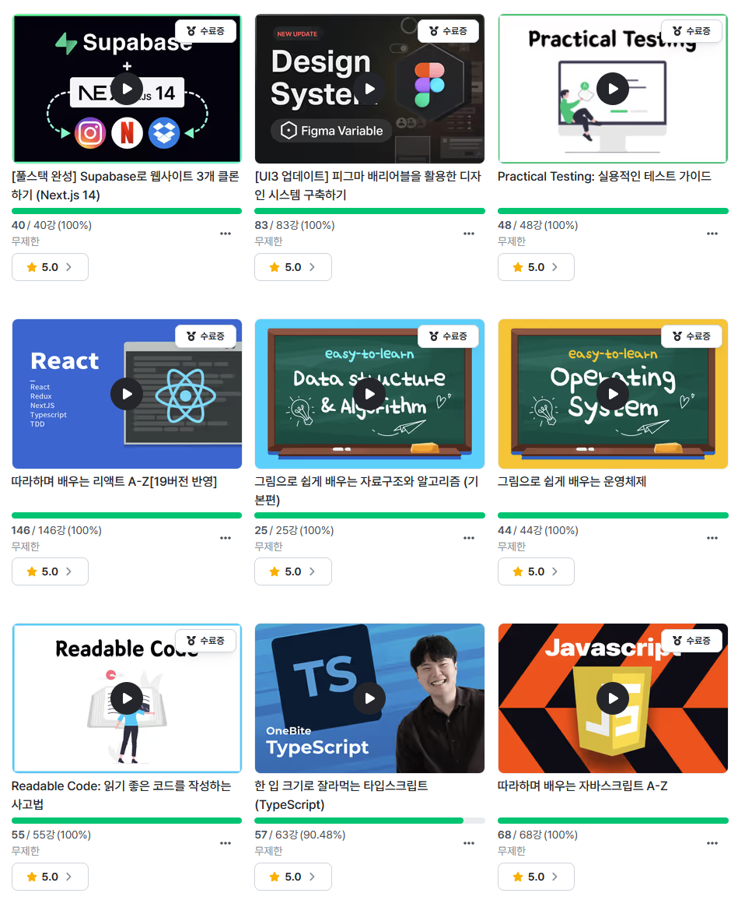
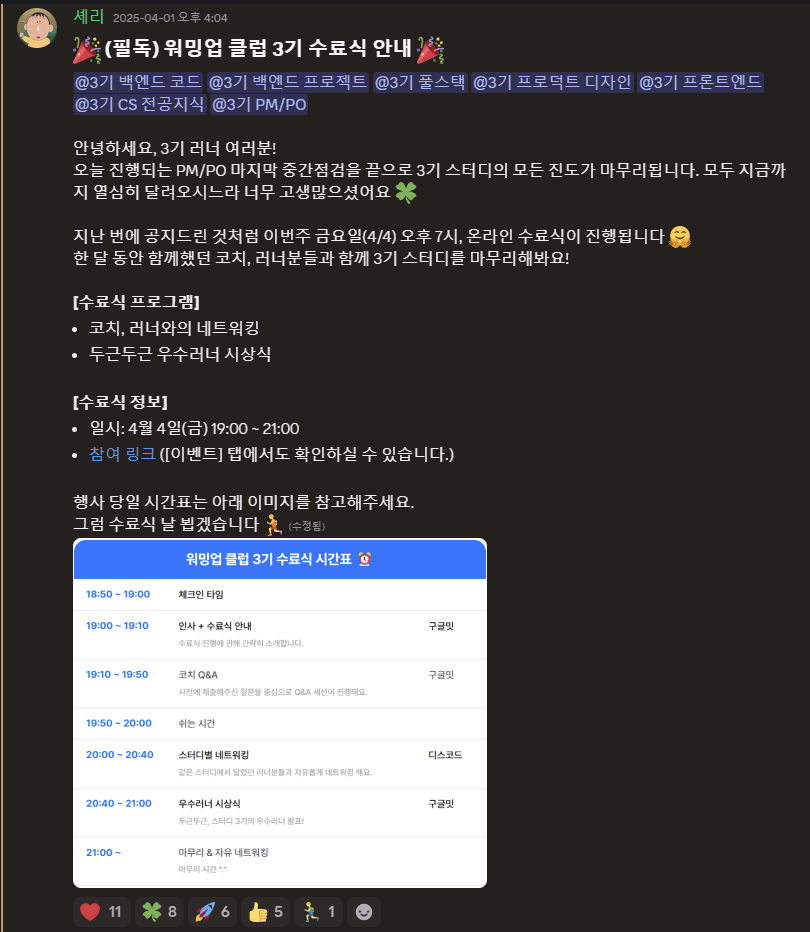
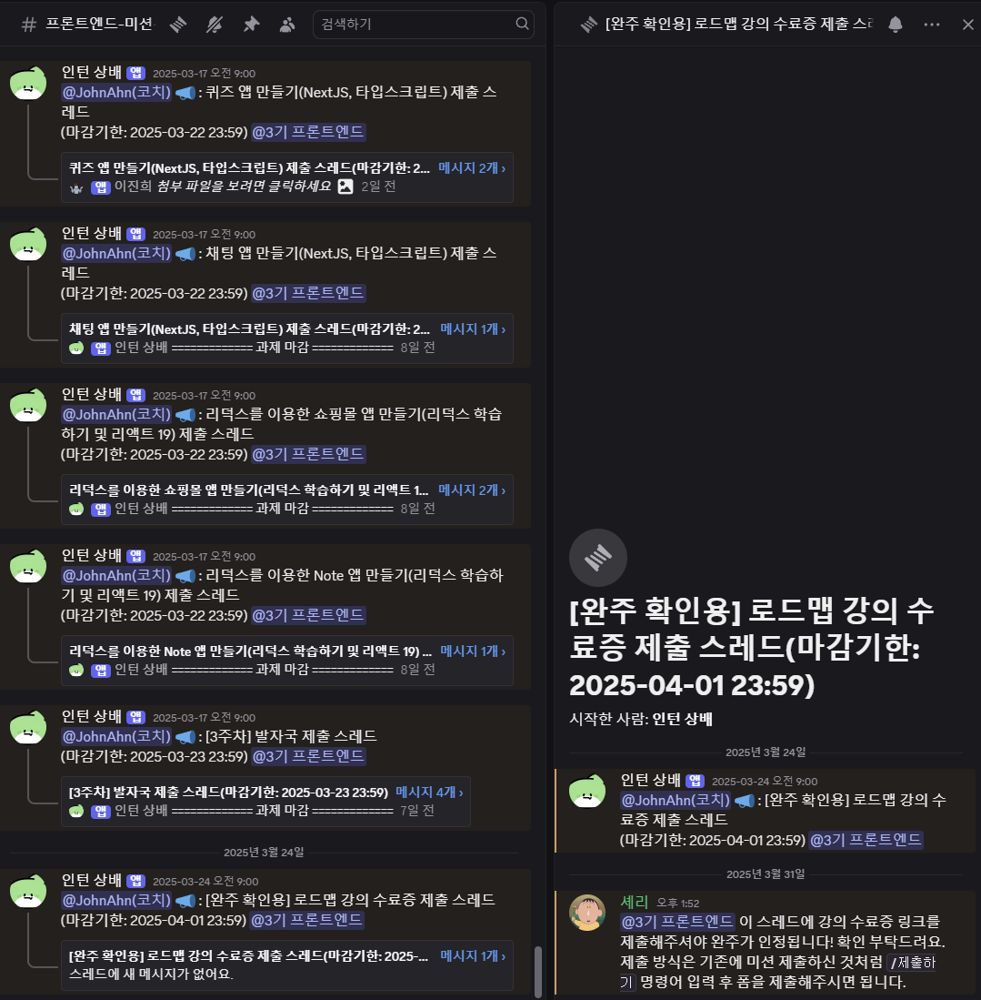
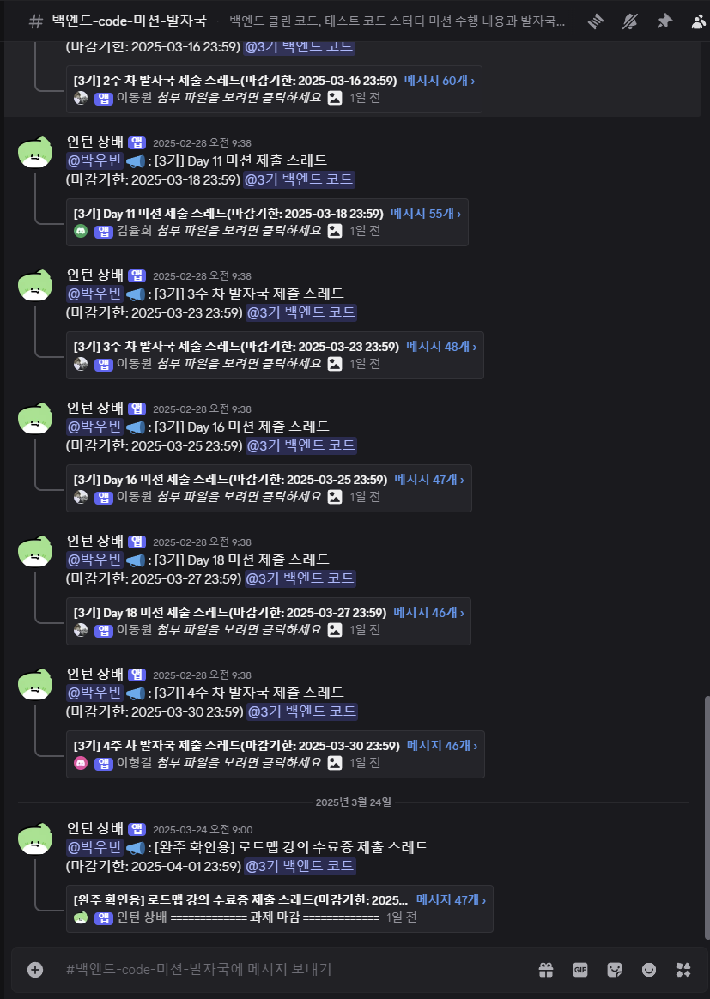
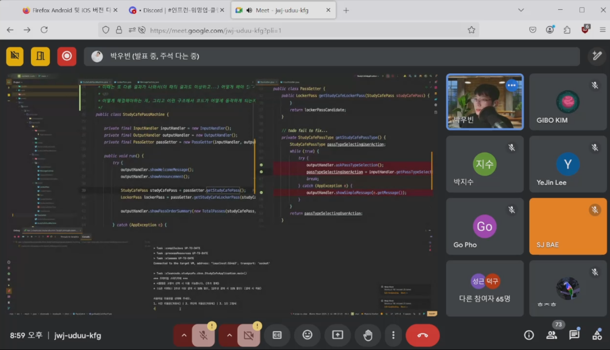
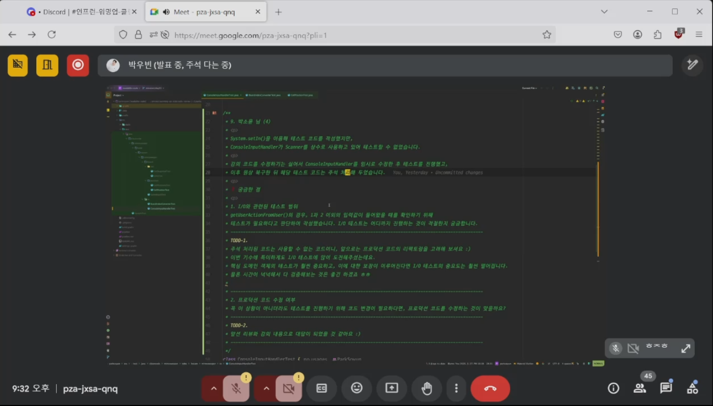
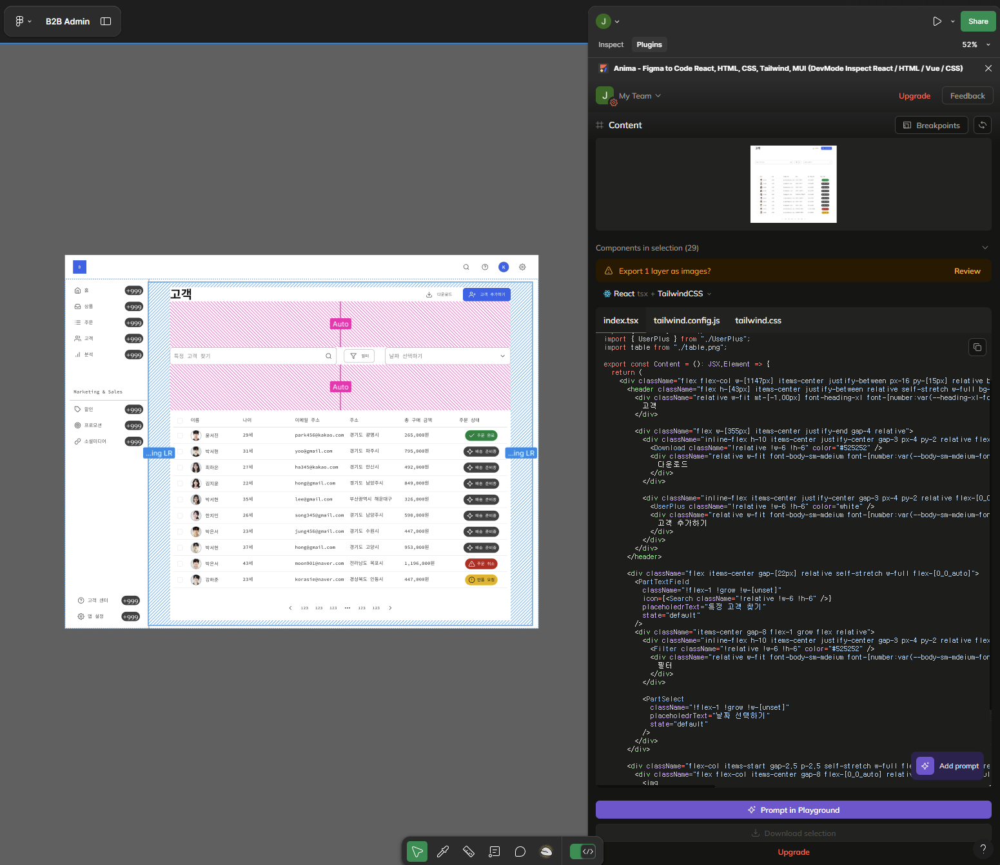
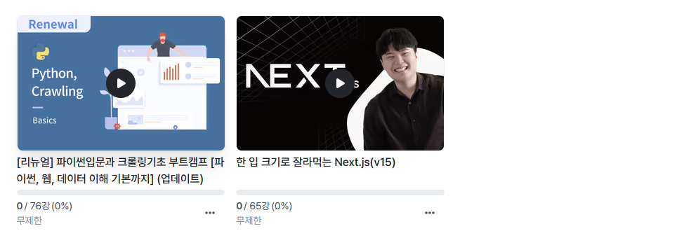
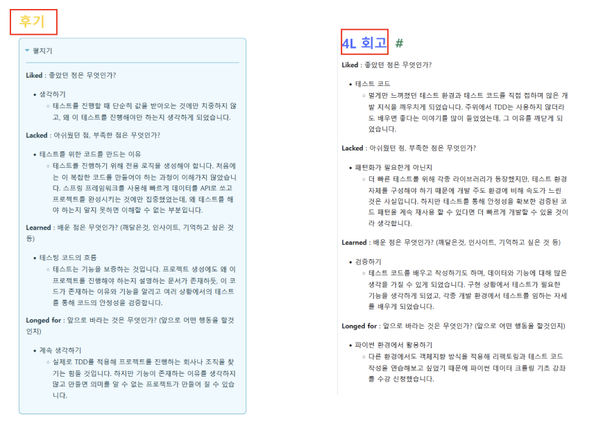

##  1.  워밍업 강의 수료식(4/4) 

  

  

1개월 동안 과제를 수행하고 제출하는 방식으로 진행됐던 워밍업 클럽이 4월 4일 진행되는 수료식을 마지막으로 끝이 납니다. 

---

##  2.  평가 

>### 1. FE(★★★☆☆)

#### 저조한 참여도
  

과제 제출에 눈치가 보일 정도로 참여도가 저조한 강의였습니다. 아마도 과제의 제출 요구 사항이 지나치게 엄격했기 때문일 수도 있습니다. 
또한, 강의가 기능 위주로만 설명하다 보니, 페이지 기초가 부족한 사람들은 과제를 제출하는 것 자체가 어려웠을 것이라고 생각됩니다. 더해서 중간 점검에서 하신 말씀 중 과제는 우수 러너 선정 기준이라는 말씀이 오히려 참여도를 떨어뜨리게 되었다고 생각합니다.

#### 강의 테마와 맞지 않음
따라하며 배운다는 테마를 강조한 강의였지만 정작 따라하며 진행하는 부분이 적습니다. 대부분 수강생이 클론 코딩을 하며 과제도 동시에 진행할 수 있는 것을 예상하고 신청했을 것인데,
정작 과제가 테마에 맞는 페이지 기능을 구현한 40초 남짓의 영상을 보고 프로젝트를 0 부터 수행하는 것이었기 때문에 많은 사람이 포기햇을 것으로 보입니다.

#### 그래도 내용은 좋았던 강의
프로젝트 구상에 필요한 내용들과 리엑트 기능 구현, 컴포넌트화를 잘 알 수 있고, 전역 상태관리에 대한 것과 Git 배포에 대한 내용도 배울 수 있습니다.
리엑트를 제대로 활용하고 있지 못한다는 생각이 들 때 한 번씩 들으면 좋은 강의라고 생각합니다.

>### 2. BE(★★★★☆)

#### 높은 참여도
  

가장 많은 사람들이 수강했고 그 영향 때문인지 참여율도 높았습니다. 다른 강의에 비해 과제가 많았음에도 불구하고 과제 수행률이 높아, 많은 사람들이 리팩토링한 코드 샘플을 수집할 수 있었고,
잘 만드는 사람들은 어떤 방식으로 사고하며 코드를 작성하는지 확인할 수 있는 좋은 강의였습니다.

#### 적극적인 강사의 참여

  
  

수강 인원이 점검을 요청하고, 강사가 평가해주는 방식의 중간 점검을 2번 진행했는데 첫 점검은 2주차 리팩토링을 진행했고, 두 번째는 테스트 코드를 진행했습니다. 
이 강의를 많은 사람들이 수강하는 이유도 이런 방식의 개발 경험을 얻을 수 있기 때문이라고 생각합니다.

#### 리팩토링과 테스트
기능 구현이 끝이 아니라 유지 보수와 가독성을 위해 좋은 코드와 데이터 모델을 사용해야 한다는 것을 알게 되었습니다. 강의 내용이 훌륭해 백엔드 지식이 부족하더라도 
쉽게 이해할 수 있을 것이라 생각이 듭니다.

>### 3. DE(★★★★★)

#### 처음부터 만드는 UI KIT
테마에 필요한 설정값과 그것을 사용한 컴포넌트를 제작하고 라이브러리를 활용해 페이지를 제작하는 것을 배울 수 있습니다. 퍙소 CSS에 대한 지식이 부족했지만 무난하게 들을 수 있는 강의였습니다.

#### 컴포넌트인 것이 문제다.
말 그대로 피그마로 컴포넌트를 디자인 하고 페이지를 만들었다면 해당 기능은 컴포넌트가 됩니다. 그 말은 개발 환경에서 컴포넌트화 되어있지 않다면 즉시 사용할 수 없는 것이기 때문에 초기 작업이 필요하게 되며, 시간적 비용을 발생시킵니다.

#### 비용도 비용

  

Anima를 사용해 해당 페이지의 코드를 Tailwind 형식으로 불러낼 수 있지만 유료이기 때문에 비용이 발생합니다. 마찬가지로 즉시 적용하지 못하기 때문에 프로젝트 내부에 UI KIT이 필요하게 됩니다.

#### 사전에 준비하면 해결될 문제
1인 개발이 아닌 이상 컴포넌트 문제는 사전에 준비할 수 있는 것들입니다. 피그마 개발의 중요한 점은 디자이너와 협업이 가능하다는 것이기 때문에, 개발 기간과 예산이 충분하다면
협업을 통해 문제 없이 빠르게 개발할 수 있을 것이라고 생각합니다.

>### 4. Full-stack(★★★★★)

#### 배우고 싶었던 내용
평소 Supabase에 관심이 많았고, 학원 개인 프로젝트에도 적용해 본 적이 있으며, 이 기술을 어떤 방식으로 활용할 수 있는지 배우고 싶었던 내용이 많이 포함되어있습니다.

#### 필요한 내용만 있는 강의
UI 작성 등은 준비되어 있었기 때문에 정말 기능 개발에 필요한 내용만 압축해서 전달하는 강의였습니다. 나중에 기능 구현이 필요한 순간에 강의에서 사용한 코드를 활용할 수 있을 것입니다.

>### 5. CS(★★★★☆)

#### 기본 내용 전달에 충실
비전공자도 컴퓨터 지식과 알고리즘을 쉽게 이해할 수 있는 시각 자료를 활용한 강의입니다. 강의를 듣는다기 보다 기초 교양을 배운다는 마음가짐으로 듣기 좋은 강의입니다.

#### 책 읽기 필수
기초적인 내용을 전달하고 있기 때문에 컴퓨터 지식에 대해 더 앍고 싶다면 전공서적을 읽는 것을 추천합니다.

---

##  3.  다음 계획 

데이터 크롤링을 통해 얻은 데이터를 저장소에 입력하고, 활용하기 위해 완강 보상으로 받은 쿠폰을 사용해 수강신청했습니다. 기능 개발에 성공한다면 괜찮은 프로젝트가 만들어 질 것 같습니다.

---

##  4.  블로그 변경점 

 

섹션의 색깔을 파랑으로 변경하고 가독성을 위해 회고 출력 방식을 변경했습니다.