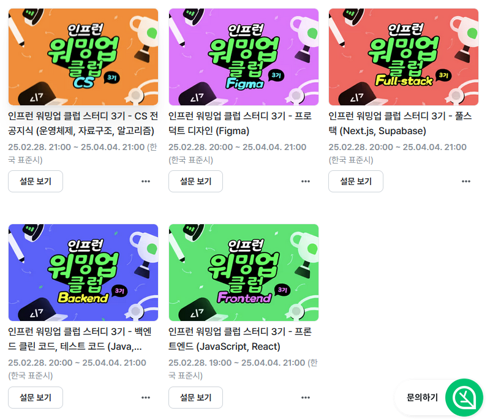
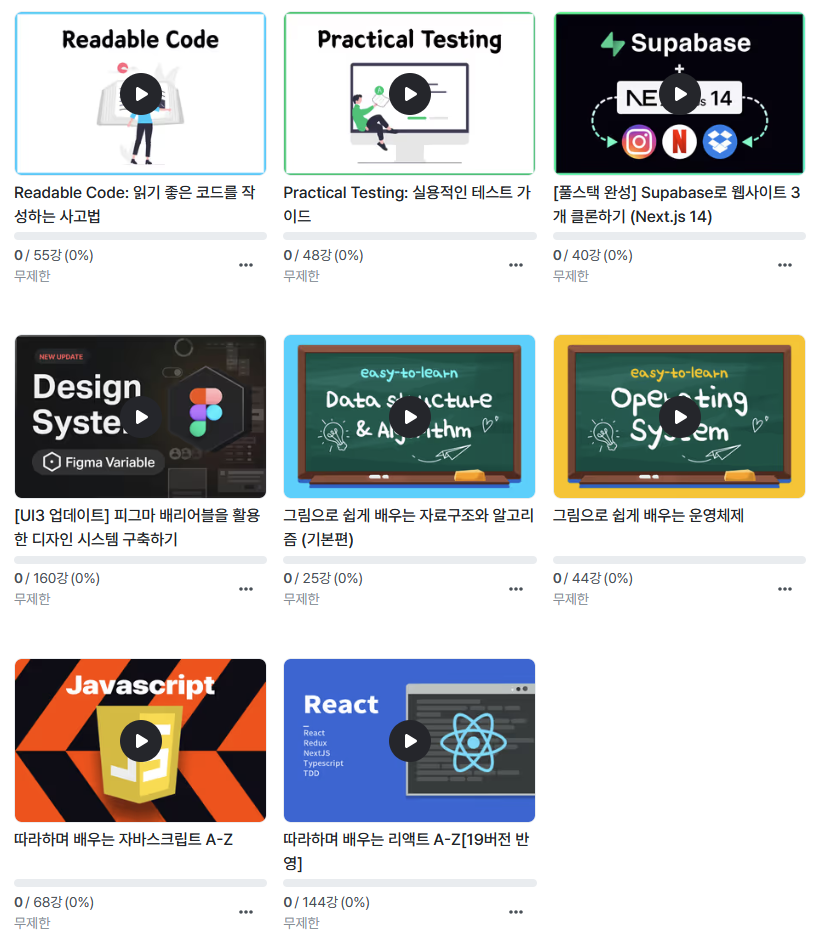
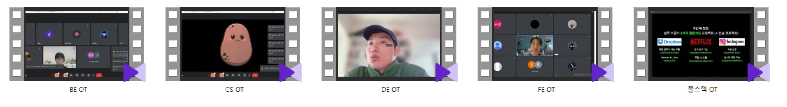
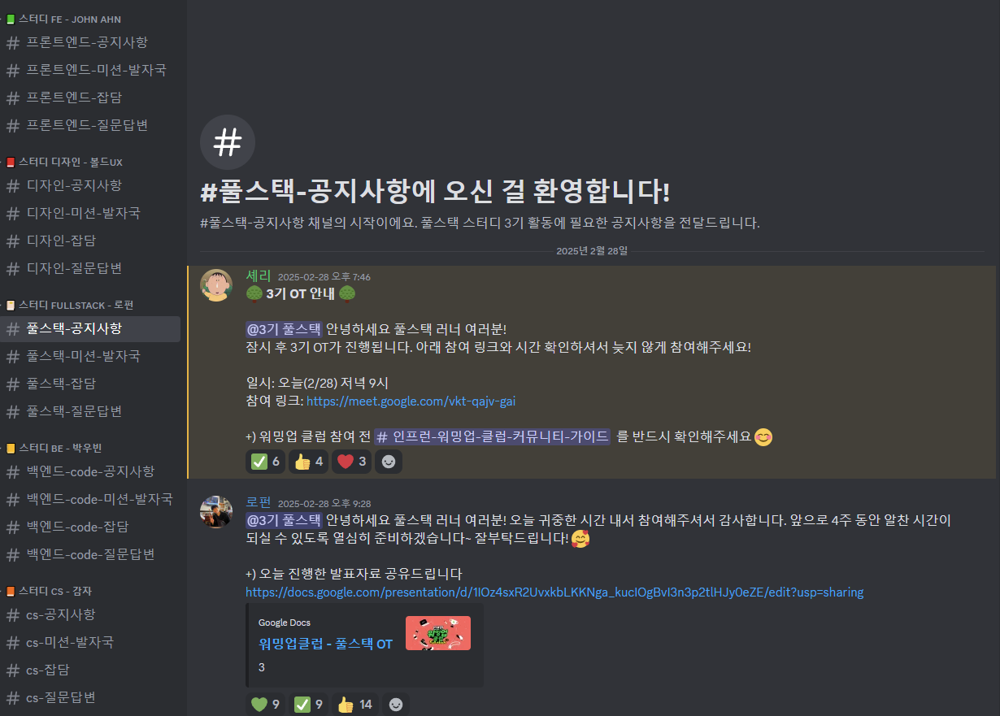
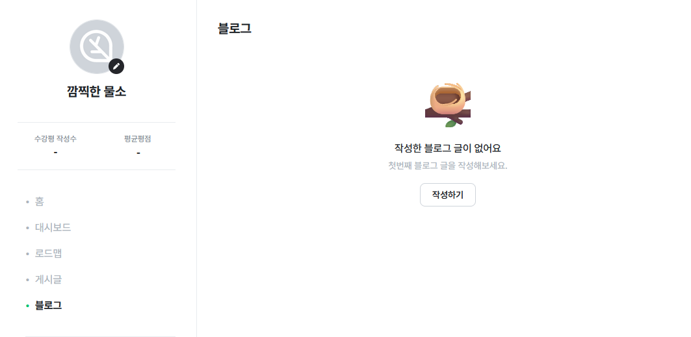

## 1.   FE - 한 입 크기로 잘라먹는 타입스크립트
>### 1. 학습 내용
- [Day 6 타입 단언, 타입 좁히기, 서로소 유니온 타입](https://blog-abl.pages.dev/docs-learn/online_course/%ED%95%9C%20%EC%9E%85%20%ED%81%AC%EA%B8%B0%EB%A1%9C%20%EC%9E%98%EB%9D%BC%EB%A8%B9%EB%8A%94%20%ED%83%80%EC%9E%85%EC%8A%A4%ED%81%AC%EB%A6%BD%ED%8A%B8/chp06)
- [Day 7 함수와 타입](https://blog-abl.pages.dev/docs-learn/online_course/%ED%95%9C%20%EC%9E%85%20%ED%81%AC%EA%B8%B0%EB%A1%9C%20%EC%9E%98%EB%9D%BC%EB%A8%B9%EB%8A%94%20%ED%83%80%EC%9E%85%EC%8A%A4%ED%81%AC%EB%A6%BD%ED%8A%B8/chp07)
- [Day 8 함수 오버로딩, 인터페이스](https://blog-abl.pages.dev/docs-learn/online_course/%ED%95%9C%20%EC%9E%85%20%ED%81%AC%EA%B8%B0%EB%A1%9C%20%EC%9E%98%EB%9D%BC%EB%A8%B9%EB%8A%94%20%ED%83%80%EC%9E%85%EC%8A%A4%ED%81%AC%EB%A6%BD%ED%8A%B8/chp08)
- [Day 9 클래스](https://blog-abl.pages.dev/docs-learn/online_course/%ED%95%9C%20%EC%9E%85%20%ED%81%AC%EA%B8%B0%EB%A1%9C%20%EC%9E%98%EB%9D%BC%EB%A8%B9%EB%8A%94%20%ED%83%80%EC%9E%85%EC%8A%A4%ED%81%AC%EB%A6%BD%ED%8A%B8/chp09)
- [Day 10 제네릭, 메서드 타입 정의하기](https://blog-abl.pages.dev/docs-learn/online_course/%ED%95%9C%20%EC%9E%85%20%ED%81%AC%EA%B8%B0%EB%A1%9C%20%EC%9E%98%EB%9D%BC%EB%A8%B9%EB%8A%94%20%ED%83%80%EC%9E%85%EC%8A%A4%ED%81%AC%EB%A6%BD%ED%8A%B8/chp10)
---
>### 2. 학습 성과
책에서는 자세하게 나와있지 않는 타입 정의와 활용하는 방법들이 많이 나왔다. 처음 학습하는 인원도 이해하기 쉽게 자바스크립트 예제를 들어 설명한다. 배운 내용을 가지고 있으면 앞으로 진행할 프로젝트 과제 수행에 문제가 없어 보인다.

---
>### 3. 진도표 (3/4~3/7)
#### Day 11 제네릭 
- Section 7 (3~6)
#### Day 12 타입 조작하기 
- Section 8
#### Day 13 조건부 타입 
- Section 9
#### Day 14 유틸리티 타입 
- Section 10

---
## 2.  인프런 워밍업 클럽
타입스크립트를 수강하고 괜찮은 공부방식이라고 생각했기 때문에 기초 능력 향상을 위한 강의를 신청했다.

---
>### 1. 클럽 신청

모집 중인 클럽의 설문조사를 통해 신청 가능하다.

---
>### 2. 강의 구매

커리큘럼을 진행하기 위한 강의를 구매해야 한다. 

---
>### 3. 오리엔테이션

많은 클럽에 신청했기 때문에 OT 시간이 겹쳐 다른 컴퓨터로 녹화본을 만들었다.

---
>### 4. 커뮤니티

공지 전달과 과제 제출 매체로 디스코드를 채택한 모습이다.

---
>### 5. 과제 제출 방법

인프런 -> 블로그 형식에 맞춰 해당 링크를 제출해야 한다.

---
>### 6. 총 시간

전체 강의는 약 99시간이며, 블로그 글 작성과 과제 제출을 고려하면 170시간 정도로 생각하고 있다. 시간을 많이 잡아먹는 강의와 실습 위주의 강의에 많은 시간을 사용할 것으로 보인다.

---
##  3.  워밍업 강의 진도표 (3/3~ 3/8) 

> ### FE (3/4~3/7)
#### Day 1 자바스크립트 기초 (과제必)
- Section 2~4
#### Day 2 자바스크립트 중급 (1) (과제必)
- Section 5 (1~8)
#### Day 3 자바스크립트 중급 (2) (과제必)
- Section 5 (9~17)
#### Day 4 OOP, 비동기 (과제必) 
- Section 6~7

----
>### BE (3/4~3/7)
#### Day 1 추상과 구체 (과제必) 
- [클린코드] Section 1~2
#### Day 2 논리, 사고의 흐름 | 객체 지향 패러다임
-  [클린코드] Section 3~4.객체 설계하기 (2)
#### Day 3 SOLID (과제必)
- [클린코드] Section 4.SOLID
#### Day 4 객체 지향 적용하기
-  [클린코드] Section 5

----
>### DE (3/4~3/7)
#### Day 1
- 피그마 베리어블과 디자인 토큰
#### Day 2 (과제必)
- 색상 베리어블 등록하기
#### Day 3 (과제必)
- 타이포그래피 베리어블 등록하기
#### Day 4 (과제必)
- 간격, 그림자 효과, 반응형 기준점, 기타 베리어블 등록하기

----
>### CS (3/3~3/7)
#### Day 1 운영체제 들어가기
- 알고리즘 Section 1
- 운영체제 Section 1
#### Day 2 프로세스와 쓰레드
- 알고리즘 Section 2 (1~3), 
- 운영체제 Section 2 (1~4)
#### Day 3 프로세스와 쓰레드
- 알고리즘 Section 2 (4~8)
- 운영체제 Section 2 (5~7)
#### Day 4 CPU 스케줄링
- 알고리즘 Section 2 (9~10)
- 운영체제 Section 3 (1~4)
#### Day 5 CPU 스케줄링 (과제必)
- 알고리즘 Section 2 (11) 
- 운영체제 Section 3 (5~7)
----
>### Full-Stack (3/4~3/8)
#### Day 1 오리엔테이션
- Section 1
#### Day 2 Next.js 기본기
- Section 2 (Next.js Part 1,2)
#### Day 3 TailWindCSS & Recoil
- Section 2 (TailWindCSS, Recoil)
#### Day 4 React Query & Supabase 소개
- Section 2 (React Query) 
- Section 3 (강의 소개)
#### Day 5 TODO List 클론 - 프로젝트 설정 & CRUD 구현
- Section 3 (Git설정, Supabase연동, CRUD 구현)

## 4.   learn_book 일정 (3월 1주차) 
>### FE - 리액트 인터뷰 가이드
- 02장: 리액트의 기본 개념과 기능 이해
- 03장: 훅: 함수 컴포넌트에 state와 다른 기능 추가하기
- 04장: 라우팅과 국제화
- 05장: 리액트의 고급 개념
>### 방법론 - 디자인 패턴의 아름다움
- 01장: 개요
- 04장: 코딩 규칙
>### CS- 서버 인프라를 지탱하는 기술
- 01장: 서버/인프라 구축 입문
>### CS - 그림으로 공부하는 IT 인프라 구조
- 01장: 인프라 아키텍처를 살펴보자
- 02장: 서버를 열어보자
- 03장: 3계층형 시스템을 살펴보자

##   블로그 일지 
일정이 아주 많아 보이지만 체계적으로 계획을 만들면 사실 별 것 없는 170시간 견적의 일정이기 때문에 시간이 드는 강의와 과제를 먼저 수행하면 충분히 가능하다고 생각했기에 즉시 진행하기로 했다. 인프런 과제의 경우 주말에 블로그에 작성한 글을 그대로 붙여넣으면 되는 형식이라 평소와 다를 것 없어 보인다.