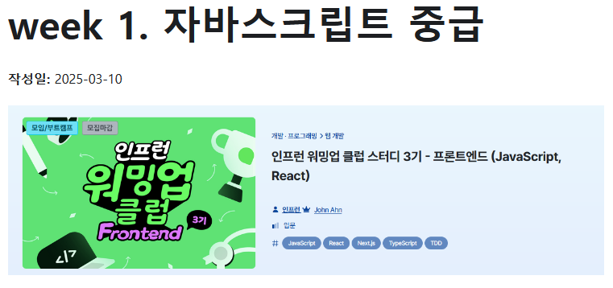
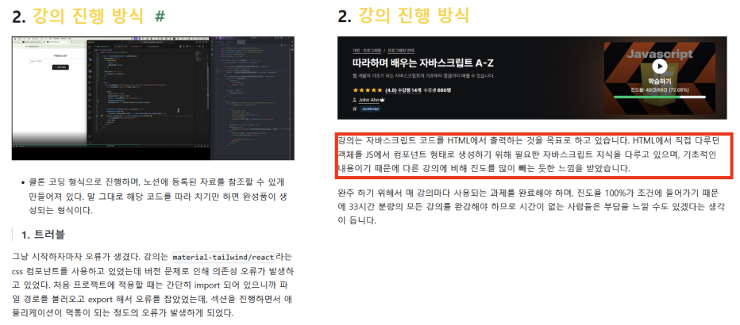
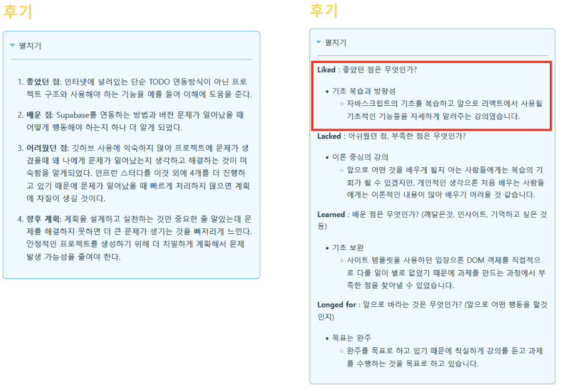
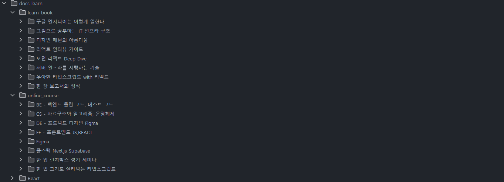

##  1.  워밍업 강의 진도표 (3/10~ 3/14) 

> ### FE (3/10~3/14)
#### Day 5 Iterator, Generator, Design Pattern (과제必)
- Section 8~9
#### Day 6 프로젝트 만들기 (과제必)
- Section 10
#### Day 7 중간 점검 
- 온라인 세션
#### Day 8 리액트 기본 및 Todo 앱 만들기 (과제必)
- Section 2~4
#### Day 9 리액트로 Netflix 만들기 (과제必)
- Section 5~6

----
>### BE (3/10~3/14)
#### Day 5 리팩토링: 코드 다듬기
- [클린코드] Section 6
#### Day 6 클린코드 리팩토링 실습
-  미션 진행
#### Day 7 리팩토링 연습 | 기억하면 좋은 조언들
- [클린코드] Section 7~9
#### Day 8 단위 테스트 | TDD | 테스트는 [  ] 다
-  [테스트] Section 1~5
#### Day 9 중간 점검
-  온라인 세션

----
>### DE (3/10~3/14)
#### Day 5 (과제必)
- 컴포넌트 준비 세팅과 입력 컴포넌트 만들어보기 파트 1
#### Day 6 
- 입력 컴포넌트 만들어보기 파트 2
#### Day 7 (과제必)
- 디스플레이 컴포넌트 만들어보기 파트 1
#### Day 8 
- 디스플레이 컴포넌트 만들어보기 파트 2
#### Day 9 
- Q&A 온라인 세션 진행

----
>### CS (3/10~3/14)
#### Day 6 프로세스 동기화
- 알고리즘 Section 3 (1)
- 운영체제 Section 4          
#### Day 7 데드락
- 알고리즘 Section 3 (2)
- 운영체제 Section 5
#### Day 8 데드락
- 알고리즘 Section 3 (3)
- 운영체제 Section 6
#### Day 9 메모리
- 알고리즘 Section 3 (4~5)
- 운영체제 Section 7
#### Day 10 중간 점검
- 온라인 세션
----
>### Full-Stack (3/10~3/14)
#### Day 6 Dropbox 클론 - 프로젝트 준비
- Section 4 (강의 소개, Git 설정)
#### Day 7 Dropbox 클론 - UI 구축(선택)
- Section 4 (UI 구축)
#### Day 8 Dropbox 클론 - 파일 업로드 구현
- Section 4 (Supabase Storage, 업로드 기능)
#### Day 9 Dropbox 클론 - 파일 삭제 & 멀티 업로드
- Section 4 (파일 제거, Drag & Drop)
#### Day 10 중간 점검
- 온라인 세션

---

## 2.   learn_book 일정 (3월 2주차) 
강의 과제 수행과 블로그를 문서를 동시에 운영하는 작업은 생각보다 많은 시간이 필요했고 예상치 못한 문제가 하나 발생했기 때문에 원래의 일정을 지키지 못해 뒤로 밀리게 되었습니다.

---
>### FE - 리액트 인터뷰 가이드
- 02장: 리액트의 기본 개념과 기능 이해
- 03장: 훅: 함수 컴포넌트에 state와 다른 기능 추가하기
- 04장: 라우팅과 국제화
- 05장: 리액트의 고급 개념
>### 방법론 - 디자인 패턴의 아름다움
- 01장: 개요
- 04장: 코딩 규칙
>### CS- 서버 인프라를 지탱하는 기술
- 01장: 서버/인프라 구축 입문
>### CS - 그림으로 공부하는 IT 인프라 구조
- 02장: 서버를 열어보자
- 03장: 3계층형 시스템을 살펴보자

---
## 3.   블로그 변경점  
>### 1. 작성 날짜 추가

- 블로그를 제외한 마크다운 문서는 작성일을 호출하려면 리액트 컴포넌트를 호출하는 mdx 문서를 사용해야 하는데 이 방법을 사용하면 버그가 생기기 쉽고 문서 이동이 일어나게 될 때 유지보수가 좋지 않아
프론트메터에 데이터 입력 후 호출하는 방식으로 변경했습니다.

---

>### 2. 경어체 사용

- 문서를 설명하는 방식을 사용할 때 경어체 채택시, 문서 내용 전달에 이점이 크기 때문에 앞으로의 문서에는 경어체를 사용하게 됩니다.

---
>### 3. 회고 방식 변경

- 기존의 회고 방식을 경어체로 변경하고 소재목을 사용해 가독성을 높였습니다.

---
>### 4. 폴더 정리(점진적으로 추가)

- 블로그가 커지면서 폴더 구조를 학습 전과 후로 나눌 필요가 생겼습니다. 내부에 있는 mdx 문서가 경로 이동시 버그를 발생시키기 때문에 시간이 생길 때 수정해나갈 예정입니다.

---
>### 5. Todo 사이드 바 추가(예정)
- 많은 일정을 관리할 때 오늘 할 일을 관리할 수 있는 카테고리가 있으면 많은 도움이 되기 때문에 블로그 기능을 추가할 예정입니다.

---
##  후기 

 펼치기 

**Liked** : 좋았던 점은 무엇인가?
- 계획한 대로 수행했음
    - 인프런 커리큘럼은 계획에 맞게 제대로 진행하게 되었습니다. 첫 주에 어떻게 해야할지 템플릿을 만들었기 때문에 문서 작성에도 속도가 붙게 될 것 같습니다.

**Lacked** : 아쉬웠던 점, 부족한 점은 무엇인가?
- 많은 일정
    - 어떤 문제가 일어났을 때 유연하게 대체하지 못하면 다른 업무를 수행할 수 없다는 것을 깨닫게 되었습니다. 풀스택 강의에서 에러를 해결하지 못해 하루를 통째로 사용했었는데, 소위 말하는 초과업무 개념으로 일을 처리하게 됐습니다.
- 시간 분배 실패
    - 위의 내용과 연결됩니다. 과제 수행과 인프런 발자국 남기기, 블로그 문서 작성 등 생각보다 바쁘게 움직여야 했는데, 문제 해결에 시간을 사용하거나 특정 개념을 이해하지 못했을 때 시간 비용을 고려하지 못했습니다.

**Learned** : 배운 점은 무엇인가? (깨달은것, 인사이트, 기억하고 싶은 것 등)
- 문서 작성 시간 단축을 위한 템플릿 추가
    - 지금까지 마크다운 명령를 사용해 문서에 필요한 컴포넌트를 추가했다면, 이제는 문서 자체의 템플릿을 만들어 알맞은 내용을 기입하는 식으로 만들어야 일정을 수행할 수 있다는 것을 배우게 되었습니다.

**Longed for** : 앞으로 바라는 것은 무엇인가? (앞으로 어떤 행동을 할것인지)
- 블로그 변경점 적용
    - 일정과 업무 수행에 차질이 생기지 않게 일정표를 만들고, 블로그의 크기가 켜졌기 때문에 더 세분화 시킬 필요가 있어 학습 진행상태로 구분할 것입니다.

