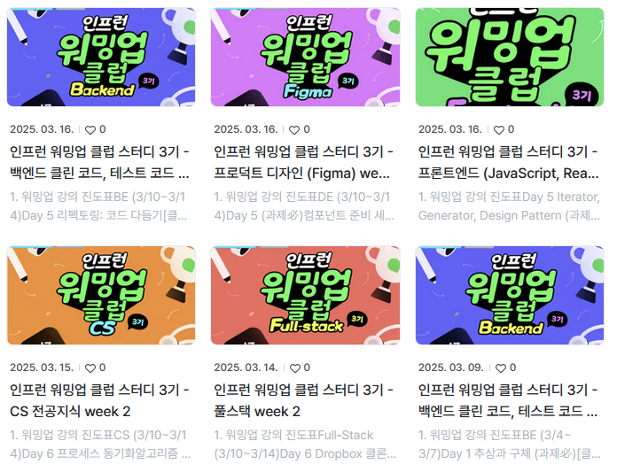
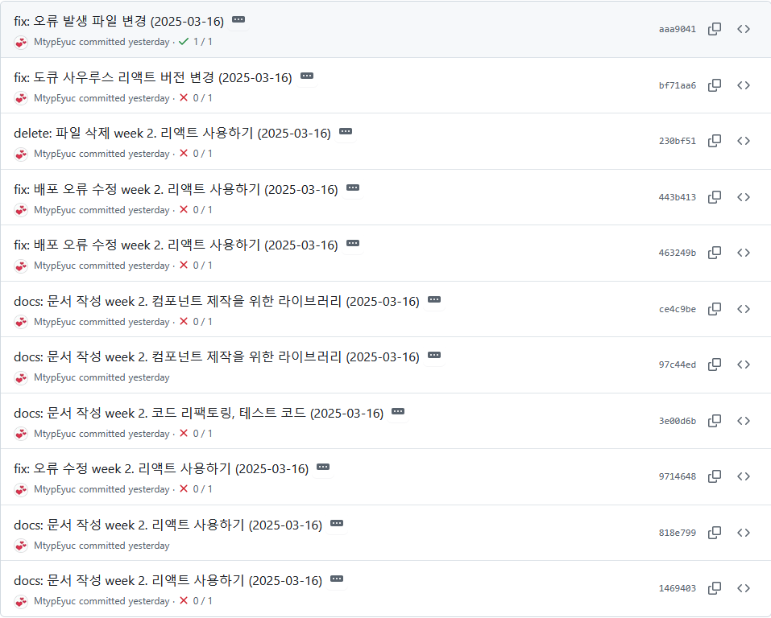
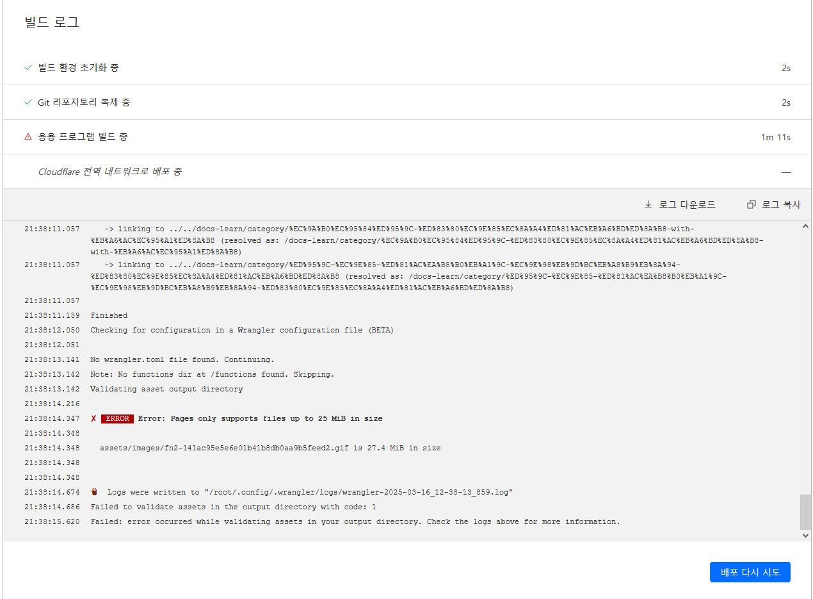

##  1.  워밍업 강의 진도표 (3/17~ 3/23) 

> ### FE (3/17~ 3/19)
#### Day 10 리액트 테스트 경험하기 (과제必)
- Section 7~8
#### Day 12 NextJS, 타입스크립트 (과제必)
- Section 9~10
#### Day 13 리덕스 학습하기 및 리액트 19 (과제必)
- Section 11~13

----
>### BE (3/17~ 3/23)
#### Day 10 테스트 코드 적용 실습 (과제必)
-  지뢰찾기, 스터디카페 중 하나를 골라, 단위 테스트를 작성해 봅시다
#### Day 11 Spring & JPA 기반 테스트: Persistence Layer
-  [테스트] 섹션 6. Persistence Layer
#### Day 12 Spring & JPA 기반 테스트: Business Layer
-  [테스트] 섹션 6. Business Layer (1-2)
#### Day 13 Spring & JPA 기반 테스트: Business Layer
-  [테스트] 섹션 6. Business Layer (3)
#### Day 14 Spring & JPA 기반 테스트: Presentation Layer
-  [테스트] 섹션 6. Presentation Layer (1)

----
>### DE (3/17~ 3/23)
#### Day 10 (과제必)
- 피드백 컴포넌트 만들기
#### Day 11 (과제必)
- 네비게이션 컴포넌트 만들기 파트 1
#### Day 12 
- 네비게이션 컴포넌트 만들기 파트 2
#### Day 13 (과제必)
- 베리어블 다크모드 개념을 익히고 활용해보기
#### Day 14 (과제必)
- 기타 베리어블 모드 활용 개념 익히고 실습해보기

----
>### CS (3/17~ 3/23)
#### Day 10 메모리
- 알고리즘 Section 3 (6)
- 운영체제 Section 8 (1~4)
#### Day 11 가상메모리
- 알고리즘 Section 3 (7)
- 운영체제 Section 8 (5)
#### Day 12 가상 메모리
- 알고리즘 Section 3 (8)
- 운영체제 Section 8 (6~7)
#### Day 13 입출력 장치
- 알고리즘 Section 3 (9)
- 운영체제 Section 9
#### Day 14 입출력 장치 (과제必)
- 알고리즘 Section 3 (10)
- 운영체제 Section 10
----
>### Full-Stack (3/17~ 3/23)
#### Day 11 Netflix 클론 - 프로젝트 준비
- Section 5 (강의 소개, Git 설정)
#### Day 12 Netflix 클론 - UI 구축 (선택)
- Section 5 (UI 구축)
#### Day 13 Netflix 클론 - 검색 & 상세 페이지
- Section 5 (검색 기능, 상세 페이지)
#### Day 14 Netflix 클론 - 무한 스크롤 & SEO
- Section 5 (무한 스크롤, SEO)
#### Day 15 Netflix 클론 - 추가 기능 구현
- 사용자 즐겨찾기 기능 추가 등

---

## 2.   learn_book 일정 (3월 3주차) 

>### FE - 리액트 인터뷰 가이드
- 06장: 리덕트: 최고의 상태 관리 솔루션
- 07장: 리액트에서 CSS를 다루는 다양한 방법
- 08장: 리액트 애플리케이션 테스팅과 디버깅
- 09장: Next.js, 개츠비, 리믹스 프레임워크를 활용한 빠른 개발
>### 방법론 - 디자인 패턴의 아름다움
- 05장: 리팩터링 기법
>### CS- 서버 인프라를 지탱하는 기술
- 02장: 한 단계 높은 서버/인프라 구축
>### CS - 그림으로 공부하는 IT 인프라 구조
- 04장: 인프라를 지탱하는 기본 이론
- 05장: 인프라를 지탱하는 응용 이론

---

## 3.   3/16 회고 
>### 1. 마감 기한과 예상치 못한 오류
  

커리큘럼에는 마감 기한이 정해져 있어, 기한 내에 과제를 제출하지 않으면 더 이상 제출할 수 없습니다. 평일에 제시되는 과제 내용을 정리하기 때문에 주말에 시간을 집중해서 후기를 작성해야 합니다.

  

마감이 1시간 남은 상황에서, 로컬에서는 확인할 수 없는 빌드 오류가 발생했습니다. 잠재적인 원인을 수정하고 의심되는 문서를 제거해 보았지만 해결되지 않았고, 버전 변경까지 시도했음에도 문제가 지속되었습니다.

결국 원인은 전혀 의심하지 않았던 파일 크기였습니다. 침착하게 오류 코드를 확인했다면 쉽게 해결할 수 있었겠지만, 급한 마음에 당황하면서 문제 해결이 늦어졌습니다. 결과적으로 컨디션이 무너졌고, 이후 작업에도 영향을 미쳤습니다.  

이 경험을 통해 급한 상황에서 오류가 발생하더라도 당황하지 말고 순차적으로 접근해야 한다는 것을 깨닫게 되었고 다음에 문제가 발생했을 때 침착하게 접근할 수 있을 것입니다.

---
##  후기 

 펼치기 

**Liked** : 좋았던 점은 무엇인가?
- 시간 규칙 준수
    - 계획한 내용을 수행하고 정리하다 보면 좋은 습관이 생기게 되는데 시간과 규칙을 준수하게 됩니다. 지금 하고 있는 것은 단순한 커리큘럼 수행처럼 보일 수 있지만, 시간 규칙을 지키도록 설계했기 때문에 업무에 지장이 가지 않는 선에서 스케쥴을 만들게 됩니다.

**Lacked** : 아쉬웠던 점, 부족한 점은 무엇인가?
- 코드를 읽지 않음
    - 오류 코드를 충분히 분석하지 않았습니다. 로컬 환경만을 생각하고 혼자 판단하여 가능성이 있는 부분을 수정했습니다.

**Learned** : 배운 점은 무엇인가? (깨달은것, 인사이트, 기억하고 싶은 것 등)
- 디자인 패턴
    - DE,BE,CS 의 내용을 정리하다 보니 각 분야에서 체계적으로 업무를 완수하기 위한 패턴이 있는 것을 확인했습니다. 주방에서의 업무 수행이나 연구소에서의 일에서도 더 세부적으로 진행할 수 있었겠다고 생각했습니다.

**Longed for** : 앞으로 바라는 것은 무엇인가? (앞으로 어떤 행동을 할것인지)
- 책 읽기
    - 3주차에 들어서면 끝나는 커리큘럼이 생기기 때문에 그 시간에 책을 읽고 더 많은 내용을 작성할 수 있게 될 것입니다.

