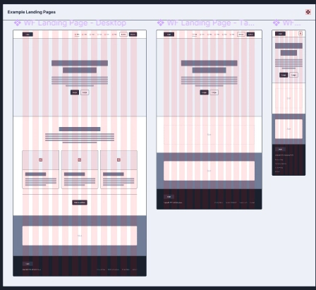
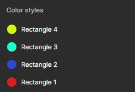
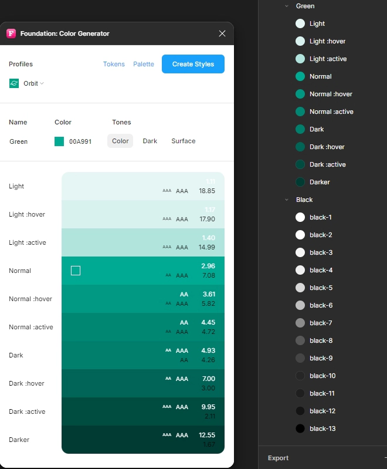

피그마에서 제공하는 모든 강의를 들었다. 학습 하면서 가장 많이 사용한 기능을 정리했다. 단축키를 몰라도 아래의 인터페이스에서 사용할 수 있다.
## 단축키
- Ctrl+Shift+K : 이미지 삽입
- Ctrl+right-click: 레이어 선택 
- Ctrl+click: 직접 선택
- Ctrl+wheel: 줌 인/아웃
- Shift+0: 100% zoom
- Shift+1: 화면 모니터 비율에 맞춤
- Shift+2: 선택한 요소 기준으로 비율 맞춤
- Ctrl+Shift+3: 외각선만 보기
- Ctrl+G: 그룹핑
- 1~0: 밝기
- F: 프레임
- R: 사각형
- O: 원형
- T: 텍스트

## 플러그인
- WireFrame: 일종의 스타터 팩이다. 나 처럼 기초가 부족한 사람들은 완성된 뼈대를 활용해 빠르게 화면을 구상할 수 있다. 화면을 보면 12개의 줄이 존재하는데 이 줄을 분할해서 적절하게 사용하면 된다.

- Styler: 자료나 그룹에 사용된 스타일을 전역 스타일로 변환시켜준다.

- Foundation: 컬러를 선택하면 해당 컬러에 맞는 그라데이션 팔레트를 사용할 수 있다.

