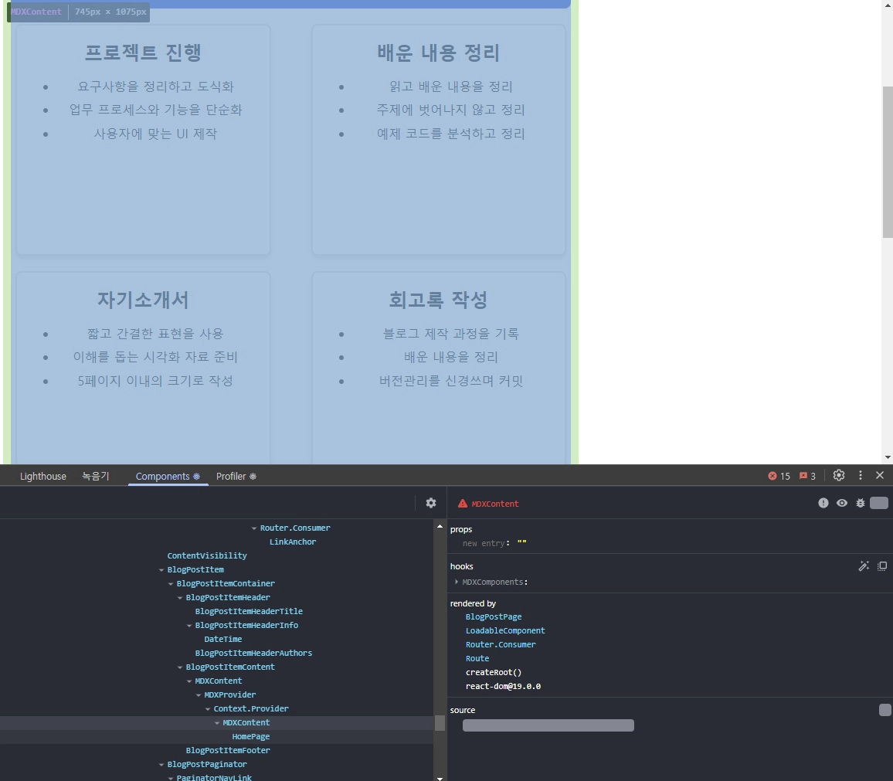
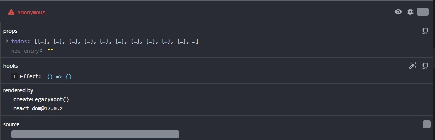
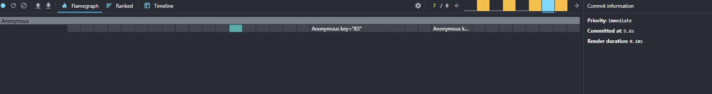

## 1. 리엑트 개발 도구란?
`react-dev-tools` 리엑트로 만들어진 다양한 애플리케이션을 디버깅하기 위해 만들어졌으며, 리엑트 웹 뿐만 아니라 리엑트 네이티브 등 다양한 플랫폼에서 사용할 수 있다. 이
## 2. 리엑트 개발 도구 설치
브라우저에 리엑트 개발 도구를 브라우저 확장 도구로 설치해야 한다. 파이어 폭스를 사용하니 문제가 생겨 크롬으로 진행해야 했다.
## 3. 리엑트 개발 도구 활용하기

### 1. 컴포넌트
Components 탭에서는 현재 리엑트 애플리케이션의 컴포넌트 트리를 확인할 수 있다. 단순히 컴포넌트의 구조뿐만 아니라 `props`와 내부 `hooks` 등 다양한 정보를 확인할 수 있다.
### 2. 프로파일러

#### 1. Flamegraph
렌더 커밋 별로 어떠한 작업이 일어났는 지 확인 가능하며 너비가 넓을수록 렌더링 시간이 오래 걸렸다는 의미이다.
#### 2. Ranked
렌더링이 오래 걸린 순서대로 나열한다.
#### 3. 타임라인
컴포넌트에서 특정 시간에 일어난 일을 확인할 수 있다.

## 작성하고 느낀 점
좋았던 점: 웹 개발자 도구만 사용하다 보니 사용할 경험이 없었는데 리엑트 개발자 도구도 편리하다.

배운 점: 리엑트 개발자 도구 사용법을 배웠다.

아쉬운 점: 대부분 웹 개발자 도구로도 알 수 있는 정보가 많아서 정말 알고 싶은 기능이 존재할 때 사용할 것 같다.

향후 계획: 웹 개발자 도구를 사용하는 분석법을 배울 것이다.

