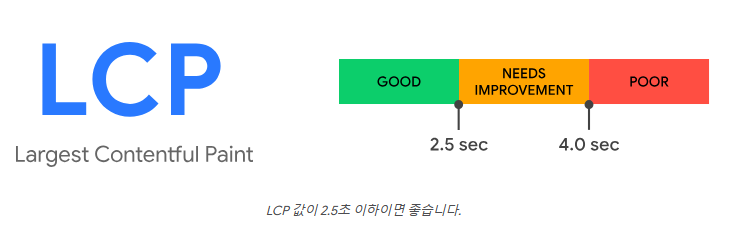
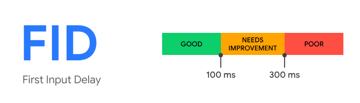
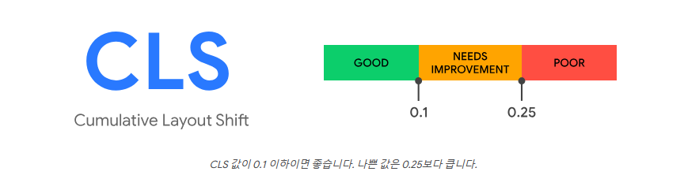
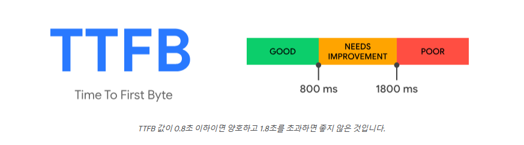
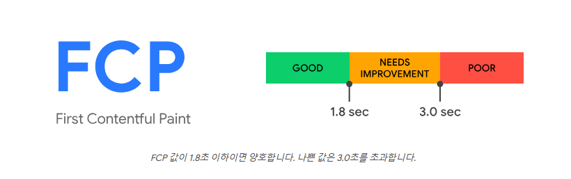

## 1. 웹사이트와 성능
### 1. 지향해야 할 세 가지 수칙
- 사용자가 방문한 목적을 손쉽게 달성할 수 있어야 한다.


- 방문 목적 달성에 걸리는 시간이 짧아야 한다.


- 사용자의 정보가 누출되는 등의 사고 없이 보안이 철저해야 한다.
### 2, 개발자가 성능에 관심을 가져야 하는 이유
- 개발 도구는 사용자의 기기 보다 성능이 뛰어나기 때문에 성능 문제를 경험하기 어려워 문제를 파악하기 어렵다. 


- 성능 향상 작업은 러닝 커브가 높고 서비스를 개발하는 작업에 비해 눈에 띄는 성능 향상을 기대하기 어려워 많은 개발자가 기피하는 작업이다.


- 하지만 웹 사이트의 성능은 조직이 이루고자 하는 목표와 직결되기 때문에 개발자는 웹 사이트의 성능에도 주의를 기울여 안정적인 사용자 경험을 위해 노력해야 한다.
## 2. 핵심 웹 지표(Core Web Vital)
구글에서 만든 지표로 좋은 웹 사이트를 분류하는 기준으로 사용된다.
### 1.핵심 지표
- 최대 콘텐츠풀 페인트(LCP: Largest Contentful Paint)


- 최초 입력 지연(FID: First Input Delay)


- 누적 레이아웃 이동(CLS: Cumulative Layout Shift)
### 2. 특정 문제 진단 지표
- 최초 바이트까지의 시간(TTFB: Time To First Byte)


- 최초 콘텐츠풀 시간(FCP: First Contentful Paint)
## 3. 최대 콘텐츠풀 페인트(LCP)
### 1. 정의
사용자 화면(뷰포트) 내부에서 가장 큰 영역을 차지하는 요소가 렌더링되는 데 얼마나 걸리는지를 측정하는 지표다.
### 2. 의미
사용자에게 메인 콘텐츠의 정보를 화면에 전달하는 속도를 객관적으로 판단하기 위해 만들어진 지표다.
### 3. 예제
LCP는 일반적으로 페이지에서 가장 크고 눈에 띄는 요소이다. 요소의 로딩 속도를 높이는 것으로 지표의 값이 달라진다.
```ts
function getLCPCandidate() {
    let largestElement = null;
    let maxArea = 0;

    document.querySelectorAll("img, video, h1, h2, h3, p, div").forEach((el) => {
        const rect = el.getBoundingClientRect();
        const area = rect.width * rect.height;

        if (area > maxArea) {
            largestElement = el;
            maxArea = area;
        }
    });

    return largestElement;
}

// 페이지 로드 후 LCP 예상 요소 출력
window.addEventListener("load", () => {
    const lcpElement = getLCPCandidate();
    console.log("예상 LCP 요소:", lcpElement);
});
```
- `PerformanceObserver`: API 를 활용해 실제 LCP를 감지 
- `getBoundingClientRect()`: 가장 큰 요소를 감지
```tsx
<!-- 중요 이미지에 preload 적용 -->
<link rel="preload" as="image" href="large-image.jpg" />

```
- LCP 요소가 이미지인 경우 `preload`를 사용해 브라우저가 요소를 미리 로드하게 만들어 시간을 단축시킬 수 있다.
### 4. [기준 점수](https://web.dev/articles/lcp?hl=ko)

### 5. 개선 방안
#### 1. 텍스트는 언제나 옳다.
텍스트는 어떤 요소보다 로딩이 빠르기 때문에 LCP 예상 영역에 문자열을 채우면 사용자에게 텍스트를 빠르게 노출하기 때문에 점수가 높아진다.
#### 2. 이미지를 어떻게 불러올 것인가?
##### 1. 프리로드 스캐너
- HTML을 해석(파싱)하는 동안, 필요한 리소스를 미리 찾고 로드하는 브라우저 기능
- `` 태그 내부의 src 속성을 보면 브라우저가 즉시 다운로드 시작한다.
-  따라서 LCP 요소가 ``일 경우 빠르게 로딩되어 좋은 성능을 기대할 수 있음
```tsx
<!-- 1) img -->

<!-- 2) svg -->
<svg xmlns="http://www.w3.org/1000/svg">
<image href="lcp.jpg" />
</svg>
<!-- 3) (비디오의 경우) vide.poster -->
<video poster="lcp.jpg"></video>
<!-- 4) background-image: url() -->
<div style="background-image: url(lcp.jpg)">...</div>
```
- `` : 프리로드 스캐너 덕분에 빠르게 로드된다.


- `<svg>`: 내부에 ``를 넣으면 프리로드 스캐너가 감지하지 못해 LCP에 불리하다.


- `<video>`: 프리로드 스캐너 덕분에 빠르게 로드된다.


- `background-image: url()` : css 리소스는 늦게 다운로드 되기 때문에 LCP에 불리하다.


#### 3. 그 밖에 조심해야 할 사항
- loading=lazy는 로딩을 늦추는 옵션으로 LCP에 불리하기 때문에 중요한 곳에는 사용하지 않는 것이 좋다.


- fadein과 같은 각종 애니메이션: fadeIn ease 10s과 같이 처리한다면 들어간 값 만큼 느려진다.


- 외부 요청시 출처 수행을 하기 때문에 리소스는 가능하면 도메인에서 직접 호스팅 하는 것이 좋다.


- 클라이언트에서 빌드하면 그만큼 시간이 지연되기 때문에 빌드 영역은 서버에서 하는 것이 좋다.
## 4. 최초 입력 지연(FID)
### 1. 정의
사용자가 페이지와 처음 상호 작용할 때 해당 상호 작용에 대한 응답으로 브라우저가 실제로 이벤트 핸들러 처리를 시작하기까지의 시간을 측정한다.
### 2. 의미
화면이 그려지고 난 뒤 상호작용을 수행할 때 메인 스레드가 이벤트에 대한 반응을 할 수 있을 때까지 걸리는 시간이다.
### 3. 예제
사용자가 클릭했을 때 응답 속도가 느리면 FID 점수가 나빠진다.
#### 1. 무거운 코드로 인한 FID 악화
```tsx
document.querySelector("button")?.addEventListener("click", () => {
    // 메인 스레드를 블로킹하는 무거운 반복문
    let start = Date.now();
    while (Date.now() - start < 3000) {
        // 3초 동안 메인 스레드 차단 🚨
    }
    console.log("버튼 클릭 처리 완료!");
});
```
#### 2. 동기적 렌더링
```html
<script>
    // 스크립트가 로드되는 동안 HTML 파싱이 중단됨 🚨
    let start = Date.now();
    while (Date.now() - start < 5000) {
        // 5초 동안 브라우저 차단
    }
    console.log("무거운 스크립트 실행 완료!");
</script>
```
#### 3. 서드파티 스크립트
```html
<!-- 서드파티 광고 스크립트가 실행되면서 메인 스레드 차단 -->
<script src="https://third-party-ad.com/ad.js"></script>
```
### 4. [기준 점수](https://web.dev/articles/fid?hl=ko)

### 5. 개선 방안
#### 1. 무거운 코드로 인한 FID 악화
```tsx
const worker = new Worker("worker.js");

document.querySelector("button")?.addEventListener("click", () => {
    worker.postMessage("startTask"); // Web Worker에서 작업 처리
});

worker.onmessage = (event) => {
    console.log("연산 결과:", event.data);
};
```
- Web Worker를 사용해 무거운 작업을 메인 스레드에서 분리한다.
#### 2. 동기적 렌더링
```tsx
window.addEventListener("DOMContentLoaded", () => {
    console.log("DOM 로드 완료!");

    setTimeout(() => {
        console.log("초기 작업 실행!");
    }, 0);
});
```
- 비동기적 방법으로 setTimeout 사용

#### 3. 서드파티 스크립트
```html
<script async src="https://third-party-ad.com/ad.js"></script>
```
- 비동기적 로딩 또는 lazy loading 사용
## 5. 누적 레이아웃 이동(CLS)
### 1. 정의
웹 페이지의 예상치 못한 레이아웃 변경 정도를 측정하는 지표다. 사용자가 보고 있는 화면이 밀리거나 가려지면 점수가 나빠진다.
### 2. 의미
렌더링 시작시 해당 위치에서 레이아웃 이동이 발생하거나 레이아웃 발생시 다른 요소의 시작 위치에 영향을 끼치면 점수가 나빠진다. 
### 3. 예제
동적 혹은 비동기적으로 무언가를 추가할 때나 이미지 크기를 지정하지 않아 사용자에게 부정적인 영향을 끼칠 수 있다.
#### 1. 이미지 크기 미지정 
```html
  <!-- width/height 없음 -->
```
- 이미지가 로드되면서 크기가 바뀌어 콘텐츠가 밀려난다.
#### 2.  동적으로 추가되는 배너
```html
<div id="ad-container"></div> 

<script>
  setTimeout(() => {
      document.getElementById("ad-container").innerHTML = 
          '';
  }, 3000);  // 3초 후 광고가 삽입되면서 콘텐츠가 밀려남!
</script>
```
- 배너가 나중에 나오면서 기존 컨텐츠를 밀어낸다.
#### 3. 비동기적으로 추가되는 요소
```html
<p>이건 중요 콘텐츠입니다.</p>
 <!-- Lazy Loading으로 늦게 로드됨 -->
```
- 이미지가 처음에 안 보이다가 로딩되면서 컨텐츠가 밀려난다.
### 4. [기준 점수](https://web.dev/articles/cls?hl=ko)

- 영향분율: 레이아웃 이동이 발생한 요소의 높이와 뷰포트 높이의 비율
- 거리분율: 이동이 발생한 요소가 움직인 거리와 뷰포트 높이의 비율
- 영향분율 x 거리분율 로 계산해 최종 점수를 계산한다.
### 5. 개선 방안
#### 1. 이미지 크기 미지정
```html
 <!-- 고정 크기 지정 -->
```
- 이미지가 들어갈 고정 공간을 미리 확보한다.
#### 2.  동적으로 추가되는 배너
```html
<div id="ad-container" style="width: 300px; height: 250px;"></div> <!-- 고정 크기 설정 -->
```
- 배너가 들어갈 고정 공간을 미리 확보한다.
#### 3. 비동기적으로 추가되는 요소
```html

```
- Lazy Loading을 사용할 경우 min-height 설정
#### 4. 폰트 로딩 최적화
- rel=preload 기능을 사용해 페이지에서 즉시 필요로 하는 리소스를 명시한다.


- [font-family](https://developer.mozilla.org/en-US/docs/Web/CSS/font-family) 설정을 추가해 폰트를 불러올 수 있다.
### 6. 성능 확인에 중요한 지표들
#### 1. [최초 바이트까지의 시간(Time To First Byte, TTFB)](https://web.dev/articles/ttfb?hl=ko#lab_tools)
페이지를 요청했을 때 최초의 응답이 오는 바이트가 얼마나 걸리는지를 측정하는 지표이다.



#### 2. [최초 콘텐츠풀 페인트(First Contentful Paint, FCP)](https://web.dev/articles/fcp?hl=ko)
페이지가 로드되기 시작한 시점부터 페이지 콘텐츠의 일부가 화면에 렌더링될 때까지의 시간을 측정하는 지표이다. 즉 웹 사이트에 **뭐라도 뜨기 시작한** 시점이다.




## 작성하고 느낀 점
좋았던 점: 간단하지 않겠지만 웹 페이지 성능을 최적화 시키는 방법을 알게 되었다.


배운 점: 성능 개선에 관심을 가져야 하는 이유와 실행하는 방법에 대해 배웠다.

아쉬운 점: 책의 예제로는 이해를 돕기 어려워 외부 자료를 활용해야 했지만 찾는 과정에서 다른 방법들을 많이 알게 되었다.


향후 계획: 핵심 웹 지표 외에 성능 측정을 위한 방법을 배워볼 것이다.
