## 1. 애플리케이션에서 확인하기
### 1. create-react-app
create-react-app 을 사용해 프로젝트를 생성하면 reportWebVitals.ts 라는 파일이 생성된다.
```ts
// reportWebVitals.ts
import { ReportHandler } from 'web-vitals'
const reportWebVitals = (onPerfEntry?: ReportHandler) => {
if (onPerfEntry && onPerfEntry instanceof Function) {
import('web-vitals').then(({ getCLS, getFID, getFCP, getLCP, getTTFB }) => {
    getCLS(onPerfEntry)
    getFID(onPerfEntry)
    getFCP(onPerfEntry)
    getLCP(onPerfEntry)
    getTTFB(onPerfEntry)
})
}
}
export default reportWebVitals
// ...
// index.tsx
// If you want to start measuring performance in your app, pass a function
// to log results (for example: reportWebVitals(console.log))
// or send to an analytics endpoint. Learn more: https://bit.ly/CRA-vitals
reportWebVitals()
```
- `PerformanceObserver` 라는 API를 사용해 브라우저에서 웹 페이지의 성능을 측정할 수 있다. 
```ts
function sendToAnalytics(metric: ReportHandler) {
const body = JSON.stringify(metric)
const url = '/api/analytics' // 지표 정보를 보낼 위치
// sendBeacon이 없다면 fetch를 사용해 보낸다.
    if (navigator.sendBeacon) {
        navigator.sendBeacon(url, body)
    } else {
// fetch나 axios 등을 사용해 보낸다.
        fetch(url, { body, method: 'POST', keepalive: true })
    }
}
reportWebVitals(sendToAnalytics)
function sendToAnalytics({ id, name, value }: ReportHandler) {
// https://support.google.com/analytics/answer/11150547?hl=en
    ga('send', 'event', {
        eventCategory: 'Web Vitals',
        eventAction: name,
        eventValue: Math.round(name === 'CLS' ? value * 1000 : value), // 정수로 보낸다.
        eventLabel: id,
        nonInteraction: true,
    })
}
reportWebVitals(sendToAnalytics)
```
- 실제로 서버나 어딘가에 기록하기 위해 `sendBeacon` 이나 `fetch` API를 사용한다.

### 2. create-next-app
성능 측정을 할 수 있는  `NextWebVitalsMetric` 메서드를 기본으로 제공한다.
```tsx
import { AppProps, NextWebVitalsMetric } from 'next/app'
/**
* @description 메트릭을 측정한다.
*/
/*
export declare type NextWebVitalsMetric = {
id: string;
startTime: number;
value: number;
} & ({
label: 'web-vital';
name: 'FCP' | 'LCP' | 'CLS' | 'FID' | 'TTFB' | 'INP';
} | {
label: 'custom';
name: 'Next.js-hydration' | 'Next.js-route-change-to-render' | 'Next.js-render';
})
*/
export function reportWebVitals(metric: NextWebVitalsMetric) {
    console.log(metric)
}
function MyApp({ Component, pageProps }: AppProps) {
    return <Component {...pageProps} />
}
export default MyApp
```
핵심 웹 지표 외에 Next.js 에 특화된 사용자 지표도 제공한다.

- Next.js-hydration: 페이지가 서버 사이드에서 렌더링되어 하이드레이션하는 데 걸린 시간


- Next.js-route-change-to-render: 페이지가 경로를 변경한 후 페이지를 렌더링을 시작하는 데 걸리는 시간


- Next.js-render: 경로 변경이 완료된 후 페이지를 렌더링하는 데 걸린 시간
## 2. 구글 라이트 하우스
구글에서 제공하는 웹 페이지 성능 측정 도구로, 오픈소스로 운영되고 있다. 별도의 애플리케이션 수정이 필요없으며 브라우저 확장 프로그램을 설치해 사용할 수 있다.
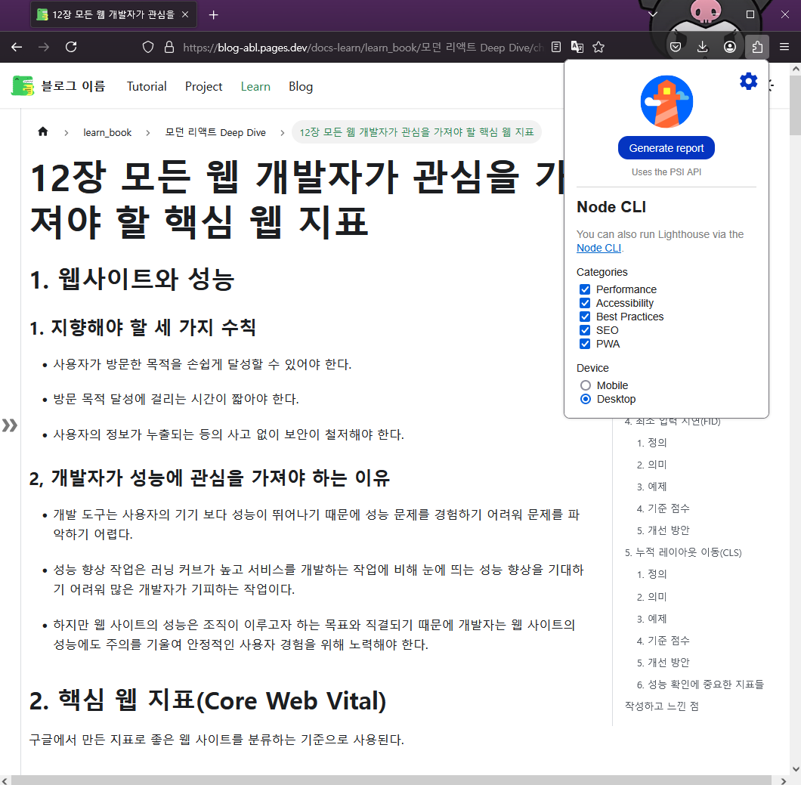
### 1. 구글 라이트 하우스 - 탐색 모드
자료 수집이 완료되면 리포트가 생성된다.
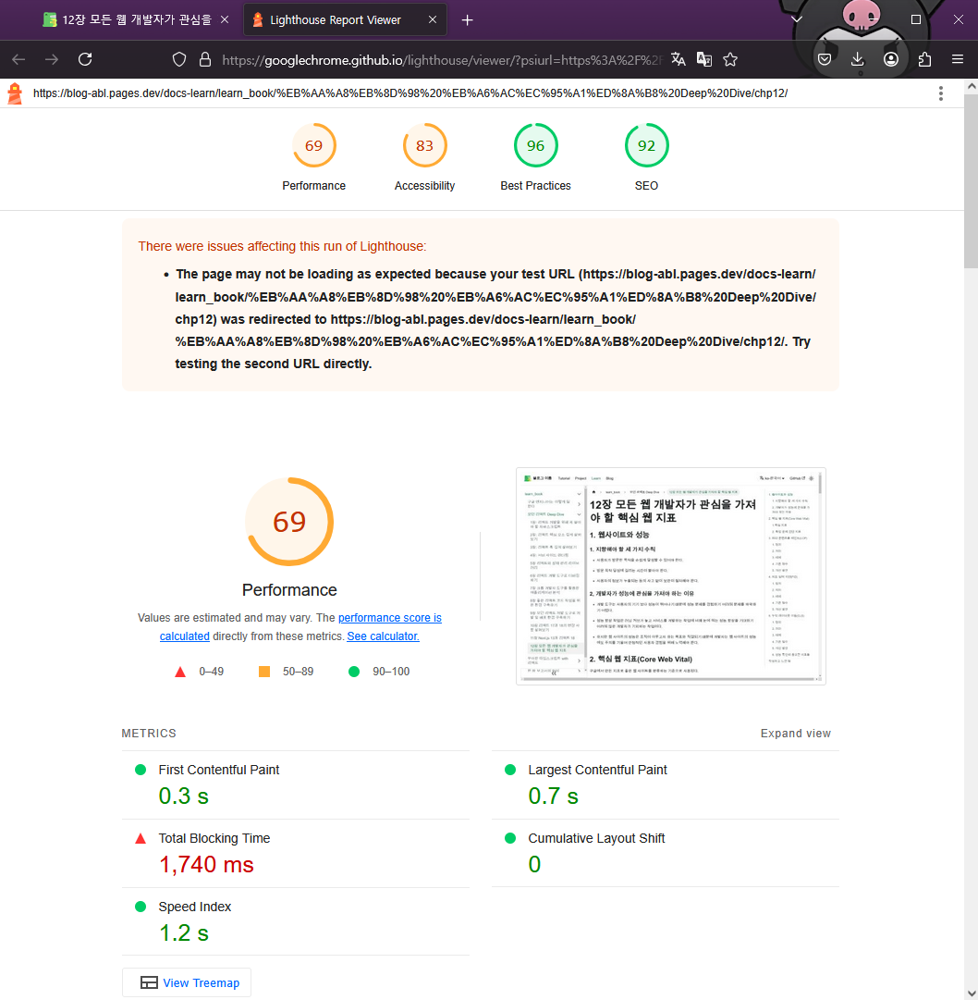
#### 1. 성능
핵심 웹 지표를 확인할 수 있으며 3가지 추가적인 지표가 있다.
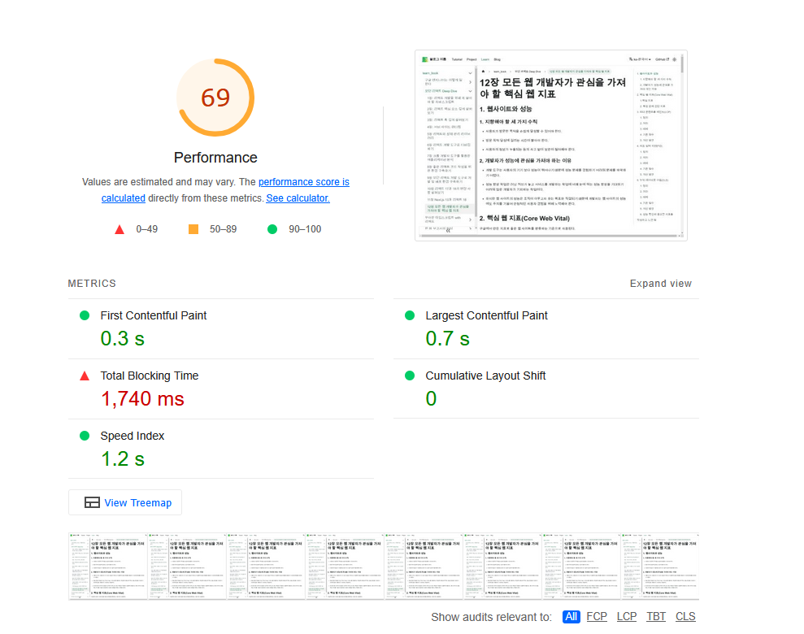
- Time to Interactive(TTI): 페이지에서 사용자가 완전히 상호작용 할 수 있을 때까지 걸린 시점이다.


- Speed Index: 페이지가 로드되는 동안 콘텐츠가 얼마나 빨리 시각적으로 표시되는지를 계산한다.


- Total Blocking Time: FCP 부터 TTI 사이의 긴 작업을 대상으로 작업 수행에 걸린 시간을 나타낸다.


#### 2. 접근성
장애인 또는 노인이 동등하게 웹페이지를 사용할 수 있도록 보장하는 것을 말한다. 지표의 점수가 낮을 시 수정 방법을 알려준다.
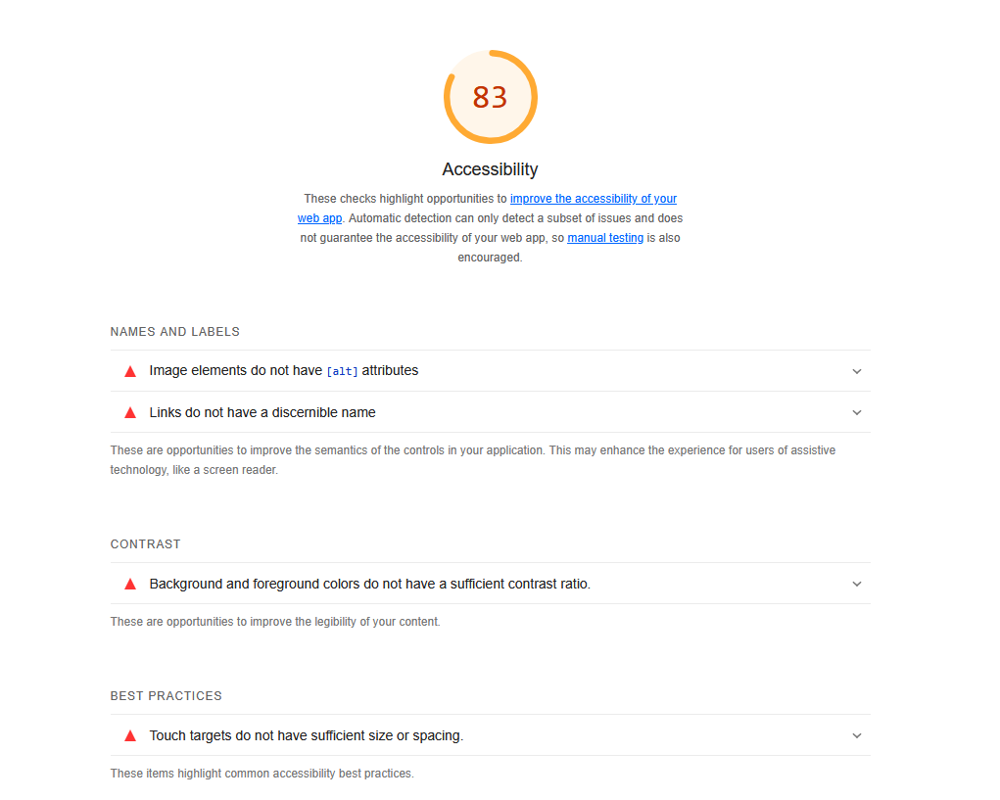
#### 3. 권장사항
웹사이트를 개발할 때 고려해야 할 요소들을 얼마나 지키고 있는지 확인할 수 있다. 권장사항에는 보안, 표준 모드, 최신 라이브러리, 소스 맵 등 다양한 요소들이 포함돼 있다.
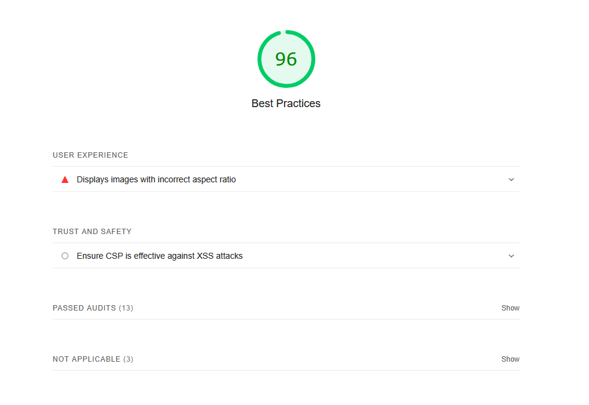
#### 4. 검색 엔진 최적화
구글과 같은 검색엔진이 쉽게 웹페이지 정보를 가져가서 공개할 수 있도록 최적화돼 있는지를 확인하는 것을 의미한다.
검색엔진에 최적화돼 있을수록 검색 엔진의 검색결과 우선순위에 높게 나타나며, 사용자가 유입될 가능성이 높아진다.
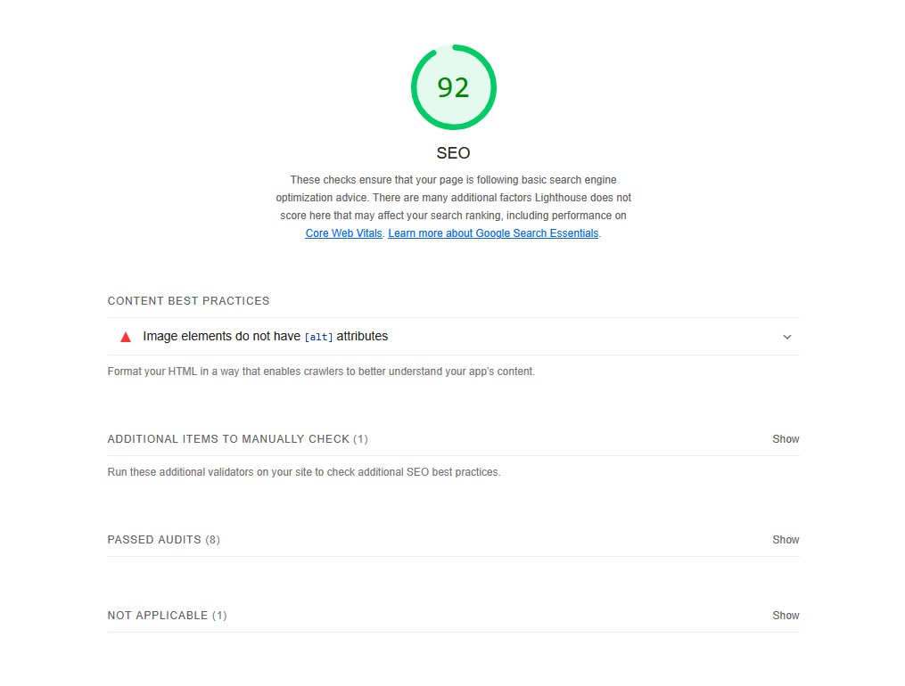

### 2. 구글 라이트 하우스 - 기간 모드
실제 웹 페이지를 탐색하는 동안의 지표를 측정한다. 개발자 도구에서  **기간 모드 시작**을 누른 뒤 성능 측정을 원하는 작업 수행 후 지표를 확인한다.
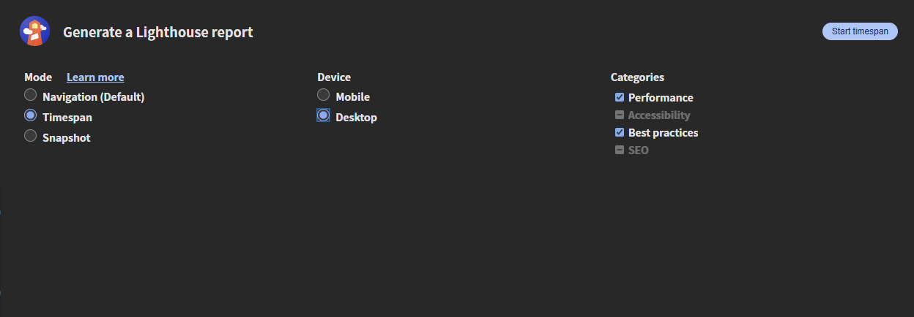
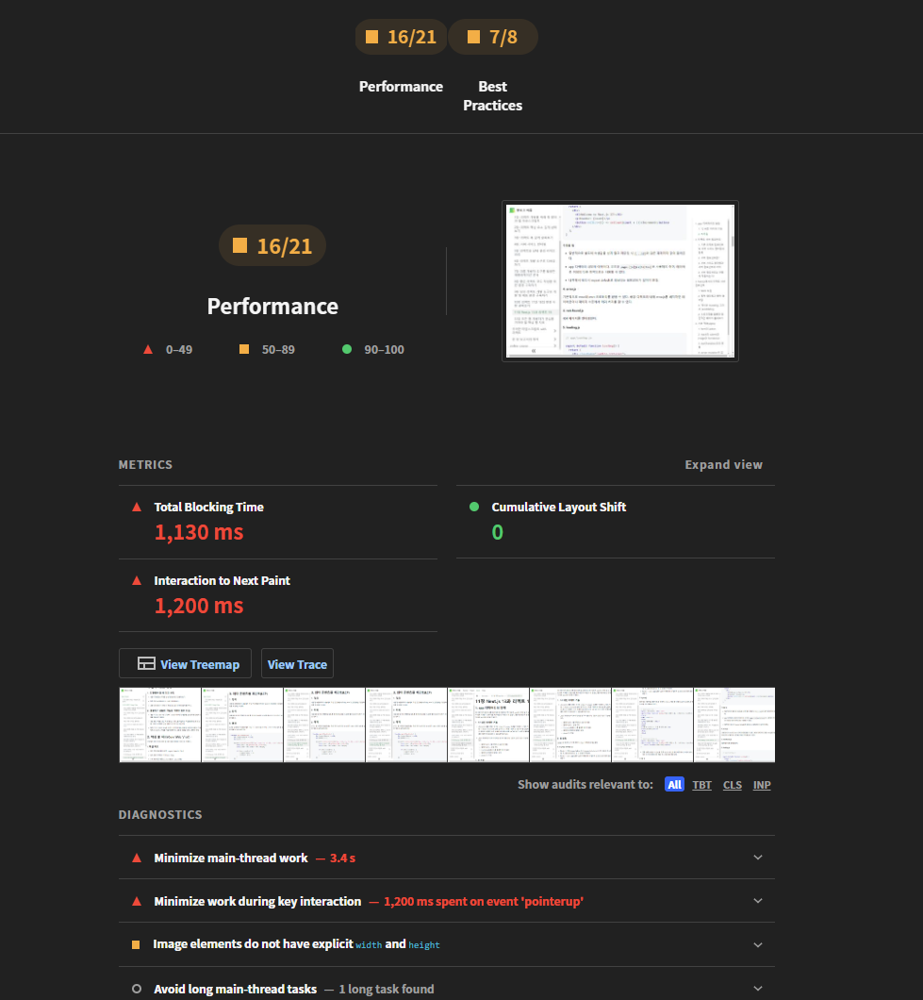
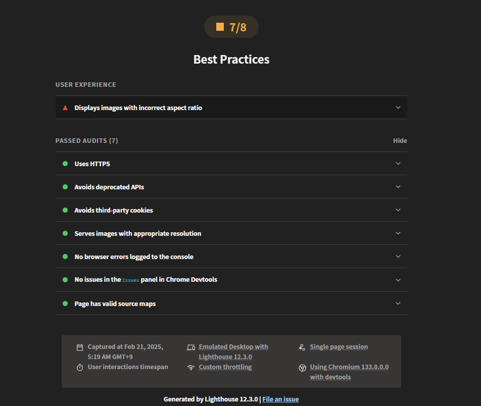
대다수의 사용자가 빈번하게 수행할 것으로 예상되는 작업을 기간 모드로 측정하면 성능 최적화에 큰 도움을 얻을 수 있다. 탐색 모드에서는 볼 수 없었던 두 가지 옵션이 생성된다.
#### 1. 흔적
상세하게 시간의 흐름에 따라 어떻게 웹페이지가 로딩됐는 지를 보여준다.
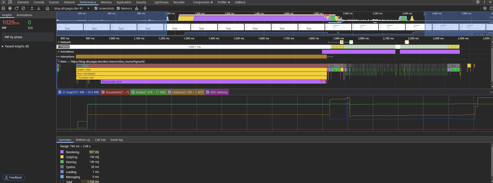
#### 2. 트리맵
웹 페이지 전체 자바스크립트 리소스에서 파일이 리소스 중 차지한 비율을 확인할 수 있으며, 압축된 코드를 읽기 좋게 변환해준다.
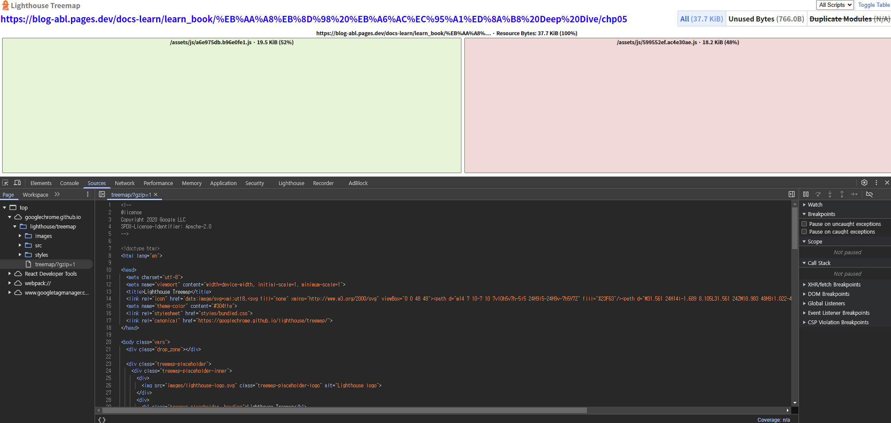
### 3. 구글 라이트 하우스 - 스냅샷
현제 페이지에서의 성능 지표를 분석한다. 특정 상태를 기준으로 분석할 때 쓰이며 일정 기간 분석을 수행하는 옵션이 아니기 때문에 분석 내용이 제한적이다.
## 3. [WebPageTest](https://www.webpagetest.org/)
웹사이트 성능을 분석하는 도구로 가장 널리 알려진 도구다. 유료 버전이 있을 정도로 심도 깊은 지표 분석을 제공한다.
### 1. WebPageTest 분석 도구
- Site Performance: 웹사이트의 성능을 분석을 위한 도구


- Core Web Vitals: 웹사이트의 핵심 웹 지표를 확인하기 위한 도구


- Lighthouse: 구글 라이트하우스 도구


- Visual Comparison: 2개 이상의 사이트를 동시에 실행해 시간의 흐름에 따른 로딩 과정을 비교하는 도구


- Traceroute: 네트워크 경로를 확인하는 도구


### 2. Performance Summary
성능 테스트는 총 3번 이뤄지기 때문에 3개의 서로 다른 결과를 확인할 수 있다.
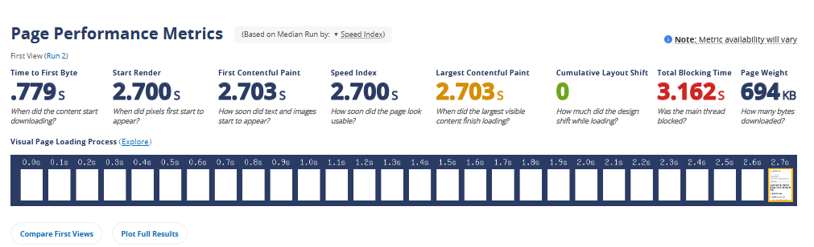
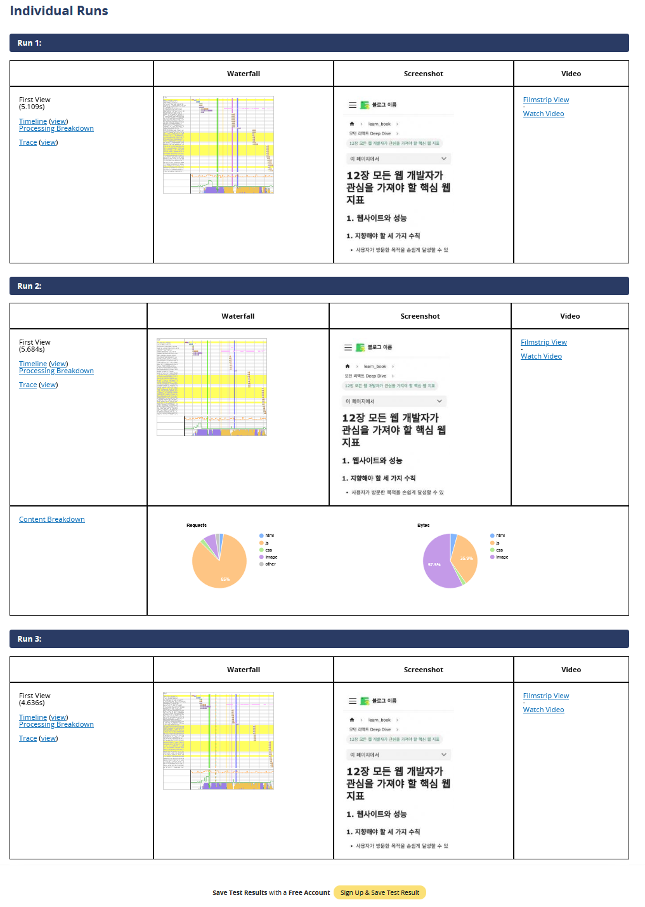

### 3. Opportunities & Experiments
웹 사이트에 대한 평가를 총 3가지로 나눠서 보여준다. 클릭해서 자세한 내용을 확인할 수 있다.
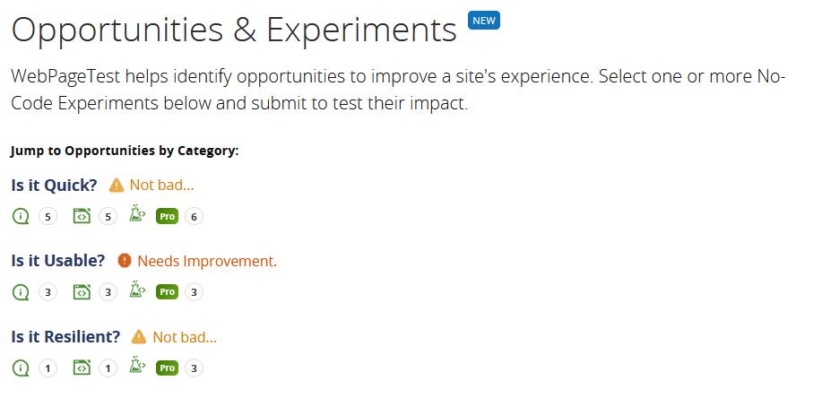
### 4. Filmstrip
마치 필름을 보는 것처럼 시간의 흐름에 따라 어떻게 웹사이트가 그려졌는지, 또 이때 어떤 리소스가 불러와졌는지 볼 수 있는 메뉴다.
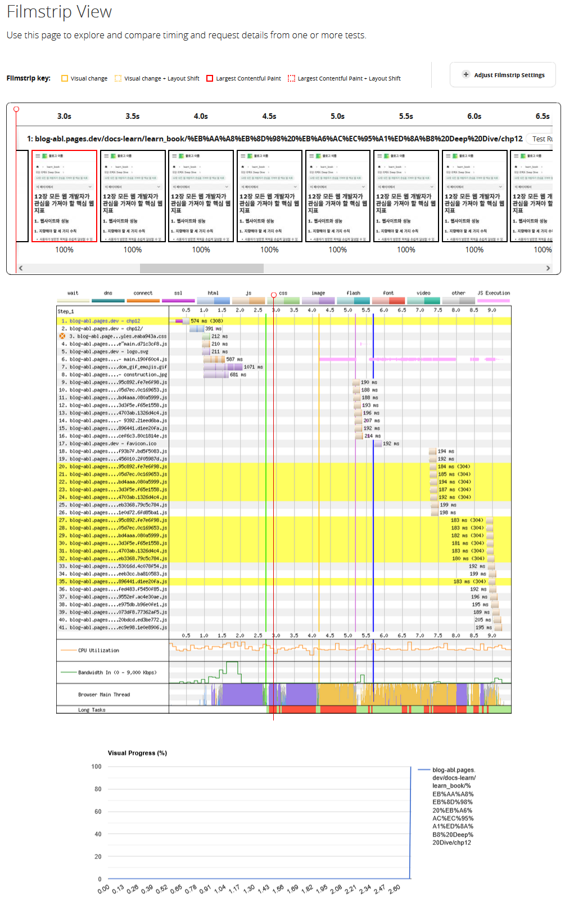
### 5. Details
Filmstrip을 더 자세하게 볼 수 있다.
### 6. Web Vitals
LCP, CLS, TBT의 자세한 내용을 확인할 수 있따.
### 7. Optimizations
최적화와 관련된 메뉴로, 리소스들이 얼마나 최적화돼 있는지 나타낸다.
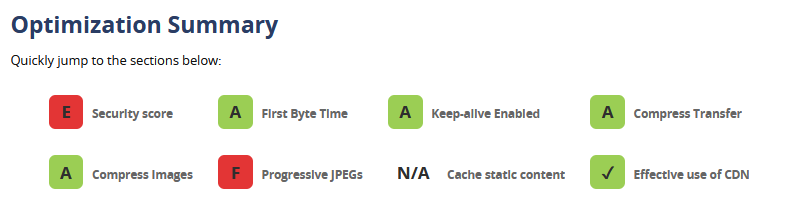
### 8. Content
웹사이트에서 제공하는 콘텐츠, 애셋을 종류별로 묶어 통계를 보여준다. 애셋 종류별 크기와 로딩 과정을 확인할 수 있으며, 시간의 흐름에 따라 렌더링을 거치면서 또 어떻게 애셋을 불러오는지도 확인할 수 있다.
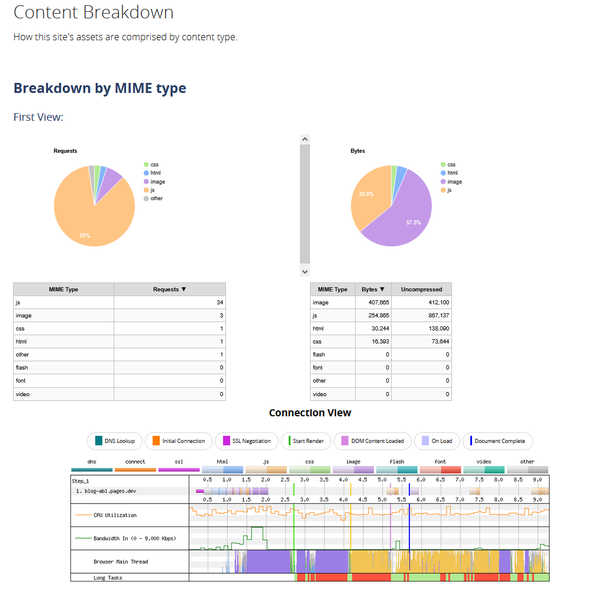
### 9. Domains
Content 메뉴에서 보여준 애셋들이 어느 도메인에서 왔는지를 도메인별로 묶어서 확인할 수 있다.그리고 해당 도메인별로 요청한 크기는 어느 정도인지도 확인할 수 있다.
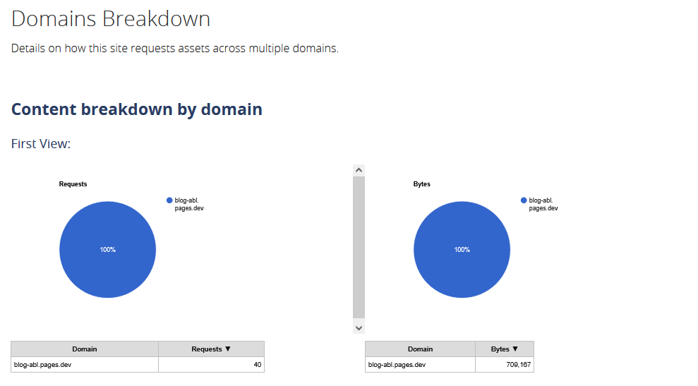
### 10. Detected Technologies
웹사이트를 개발하는 데 사용된 기술을 확인할 수 있는 메뉴다.
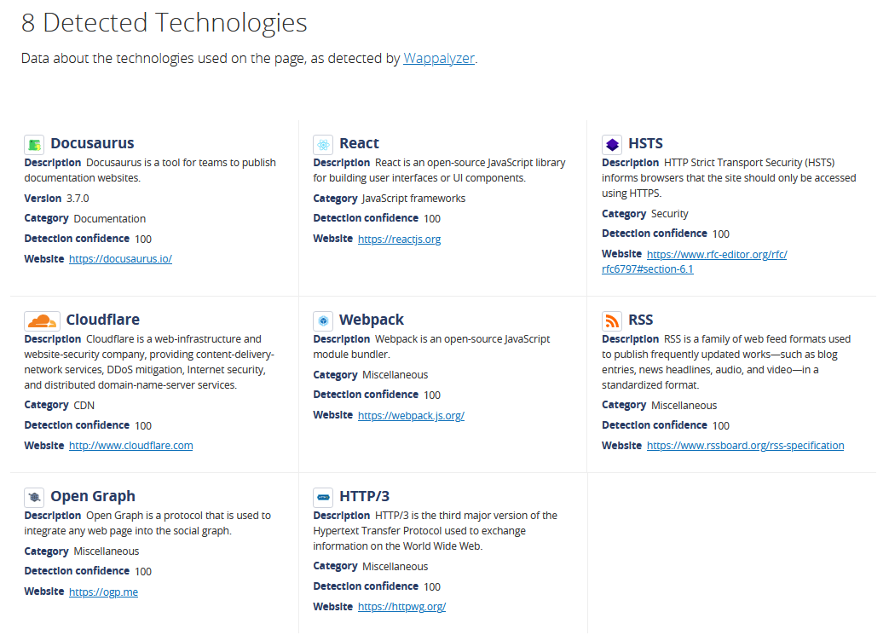
### 11. Main-thread Processing
#### 1. Processing Breakdown
메인 스레드가 어떤 작업을 처리했는지 확인할 수 있다. 또한 실제로 어떠한 작업을 하고 있었는지 상세하게 확인할 수 있다.
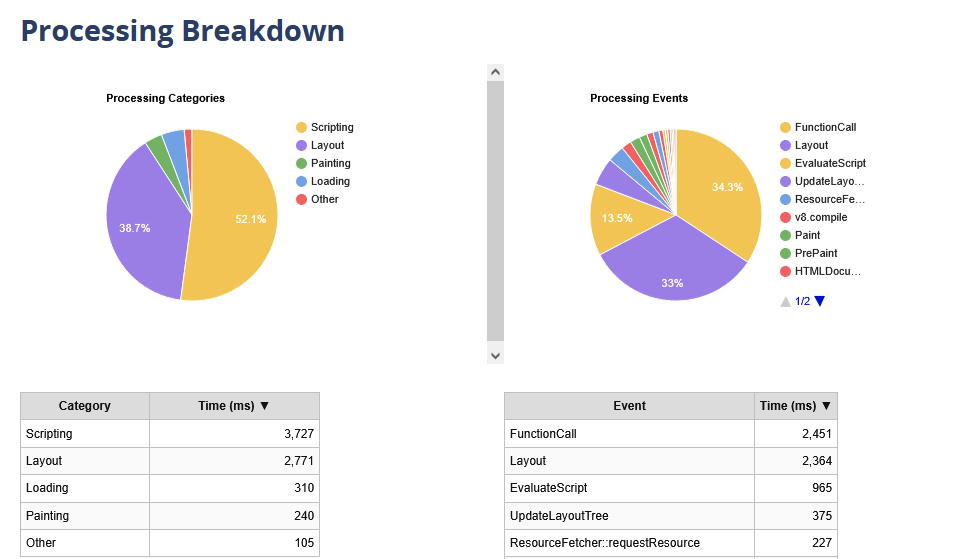
#### 2. Timing Breakdown
유휴 시간을 포함해 메인 스레드의 작업을 확인할 수 있다.
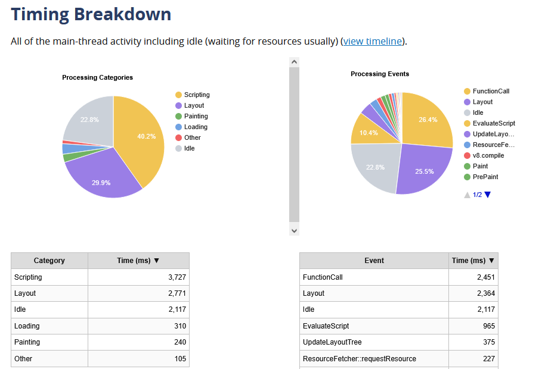

## 4. 크롬 개발자 도구
책은 `Performance Insights`를 사용해 성능 지표를 확인하는 설명을 하고 있다. 지원을 중단했기 때문에 책의 예제는 사용할 수 없다. 기존에 지원하던 도구들은 실험실 탭으로 가거나 설정 - 트롤링 옵션을 통해 이용할 수 있다. 사용법은 영상에서 확인 가능하다.
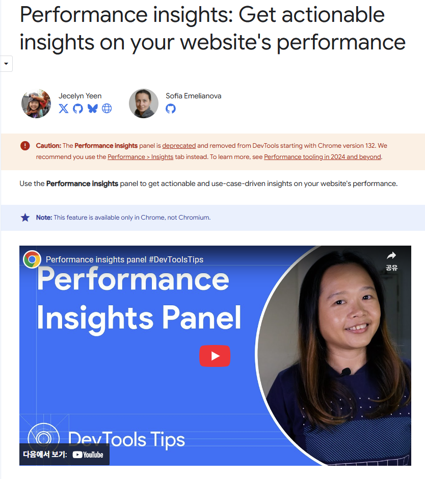
<iframe width="560" height="315" src="https://www.youtube.com/embed/5PFmGeCZDvw?si=lBN_uEQSEfU0RgL0" title="YouTube video player" frameborder="0" allow="accelerometer; autoplay; clipboard-write; encrypted-media; gyroscope; picture-in-picture; web-share" referrerpolicy="strict-origin-when-cross-origin" allowfullscreen></iframe>

## 작성하고 느낀 점
좋았던 점: 성능 확인 도구를 직접 실습하며 기초적인 이해를 돕는 예제가 있어서 좋았다.
배운 점:성능 확인 도구를 사용해 웹 페이지 성능을 확인하는 방법을 배웠다.
아쉬운 점: `Performance Insights` 옵션을 사용할 수 없게 되어 아쉽다.
향후 계획: 웹 페이지 성능 지표를 확인해가며 웹 페이지를 고쳐나가는 방법을 배웠기 때문에 다음에 애플리케이션을 만들 때 사용해 볼 것이다.


