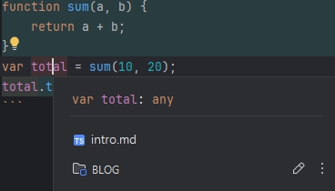

## 웹 어플리케이션의 발전

- 시대의 흐름에 따라 웹 어플리케이션의 개발 규모가 커졌고 커진 규모에 맞게 투입 인원 역시 증가한다.
  동적 타입인 자바스크립트 특성상 협업에 적합한 언어가 이니었고, 그 한계를 극복하기 위해 타입스크립트가
  만들어지게 되었다.

# 타입스크립트의 특징
  ## 안정성 보장
- 정적 언어인 타입스크립트는 컴파일 단계에서 타입 검사를 하기 때문에 타입 에러를 줄일 수 있어 안정성이 크게 높아진다.
```typescript
function sum(a: number, b: number) {
    return a + b;
}
sum('10', '20'); // Error: '10'은 number에 할당될 수 없습니다.
```
## 개발 생산성 향상
- IDE 사용시 자동 완성 기능을 제공한다. 이 기능을 사용하여 변수와 함수 타입을 추론할 수 있다.
```typescript
function sum(a, b) {
    return a + b;
}
var total = sum(10, 20);
total.toLocaleString();
```


## 협업에 유리
- 안터페이스와 제너릭을 지원하기 때문에 복잡한 코드를 더 쉽게 설명하고 이해할 수 있게 된다.

```typescript
interface Person {
    name: string;
    age: number;
}

interface Programmer {
    favoriteProgrammingLanguage: string;
}

interface Korean extends Person, Programmer { // 두개의 인터페이스를 받아 확장
    isLiveInSeoul: boolean;
}

const person: Korean = {
    name: '홍길동',
    age: 33,
    favoriteProgrammingLanguage: 'kor',
    isLiveInSeoul: true,
};
```
[📘-타입스크립트-인터페이스-💯-활용하기](https://inpa.tistory.com/entry/TS-%F0%9F%93%98-%ED%83%80%EC%9E%85%EC%8A%A4%ED%81%AC%EB%A6%BD%ED%8A%B8-%EC%9D%B8%ED%84%B0%ED%8E%98%EC%9D%B4%EC%8A%A4-%F0%9F%92%AF-%ED%99%9C%EC%9A%A9%ED%95%98%EA%B8%B0)

## 자바스크립트에 점진적으로 적용 가능
- 자바스크립트의 슈퍼셋이기 때문에 자바스크립트를 사용중인 프로젝트라면 타입스크립트를 사용한 협업이 가능해진다.
