## 시작하기

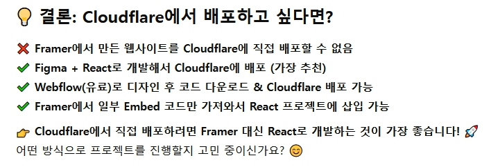

웹 디자인 프로그램을 선택할때 `Webflow`로 작업시 제약이 따르기 때문에 `Figma`를 배워보기로 했다.

[피그마 비기너](https://www.youtube.com/watch?v=ezldKx-jPag)를 참고해 사용법을 익혔다.

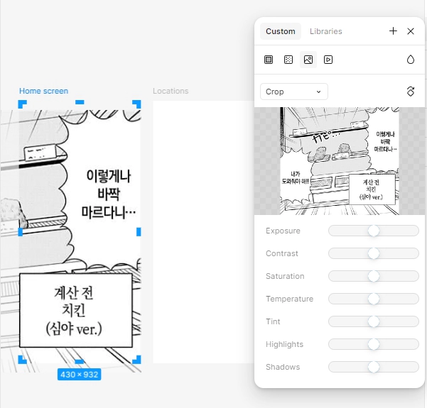  

프레임을 만들고 배경을 채워넣거나 각종 도형을 넣을 수 있다.  

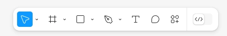 

피그마에서 사용하는 기본 툴의 모음이다. 화면을 이동하거나 제작한 도형을 선택할 수 있다.

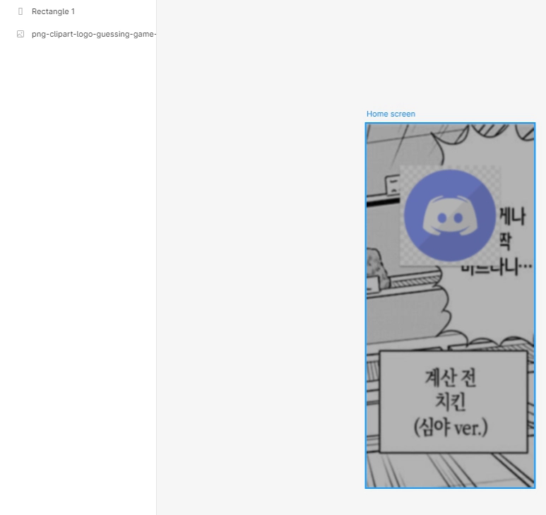 

도형을 늘리고 투명도를 높여 필터를 만들거나 이미지를 넣을 수 있다.

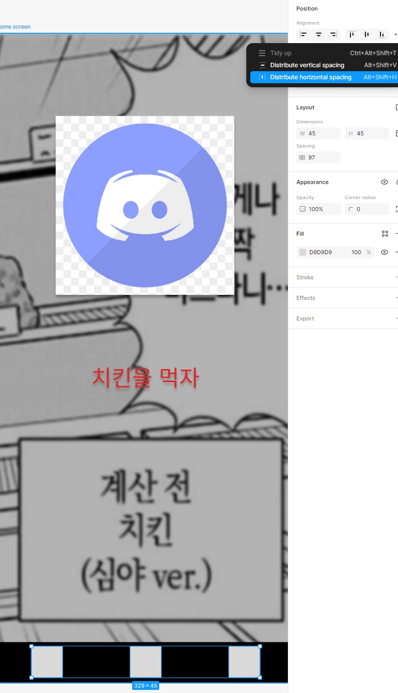 

레이아웃을 만들고 아이콘으로 사용할 도형을 정렬할 수 있다.

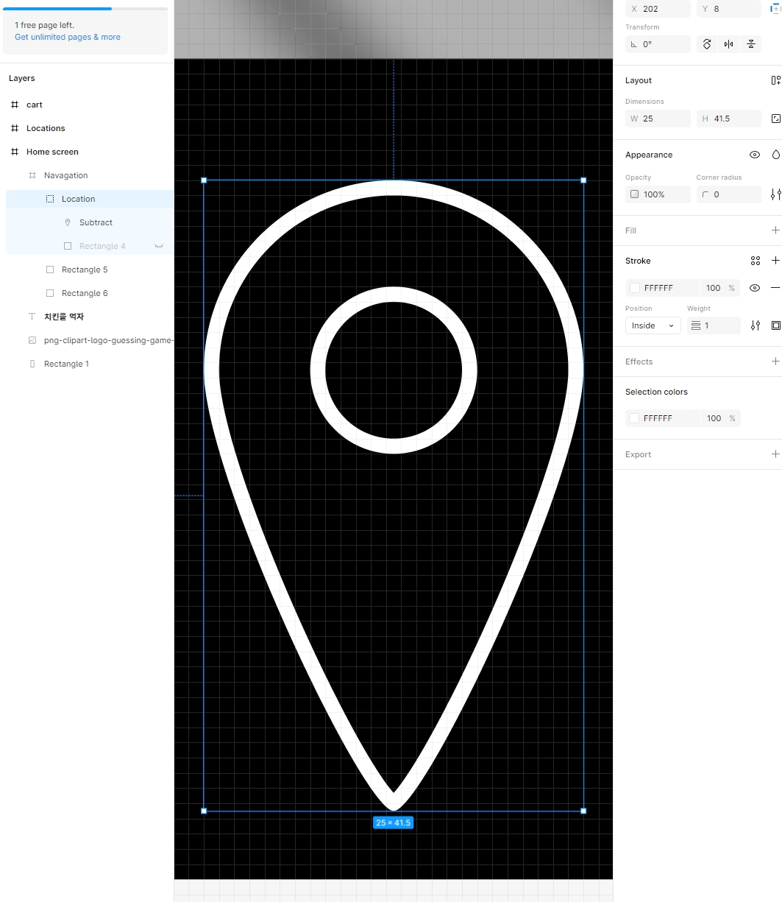 

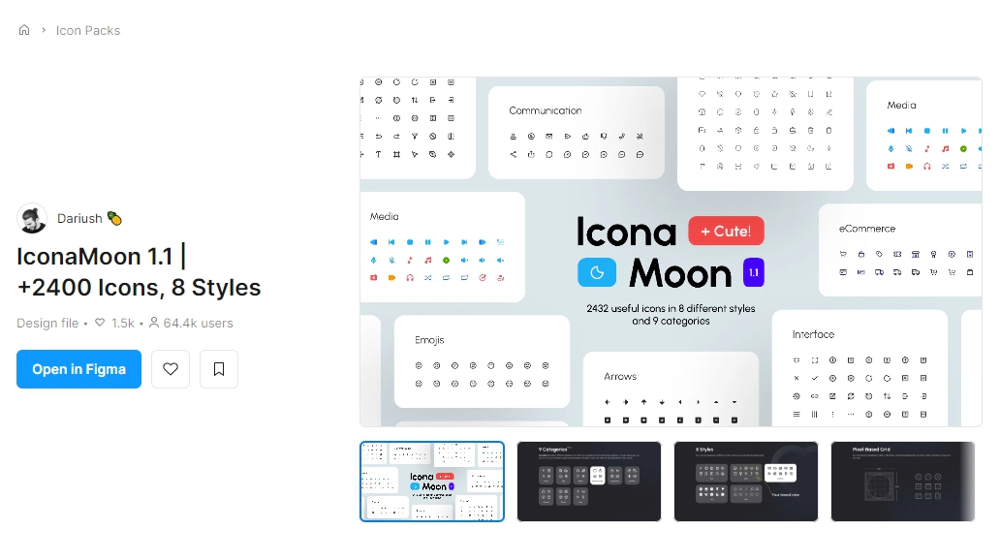 

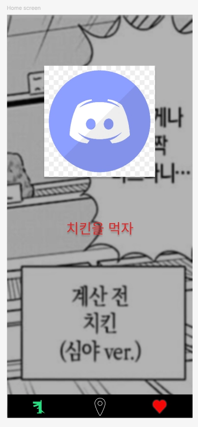 

스스로 아이콘을 만들거나 배포된 아이콘을 사용할 수 있다.

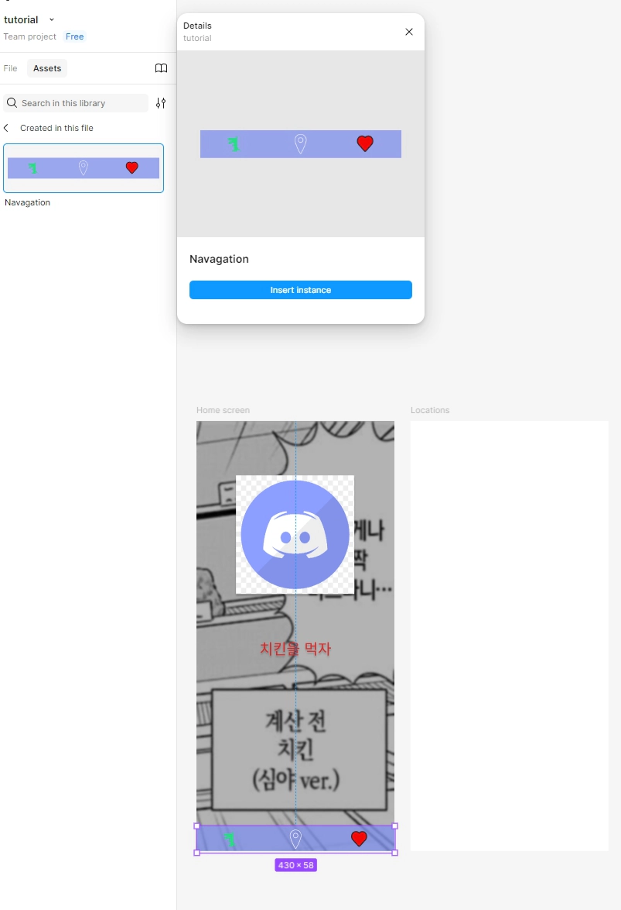
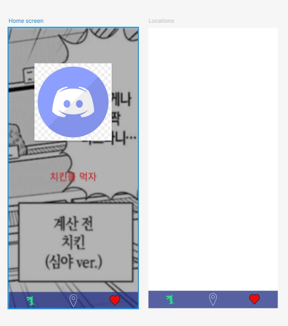
집합을 만들어 컴포넌트 형식으로 전역 사용할 수 있다.

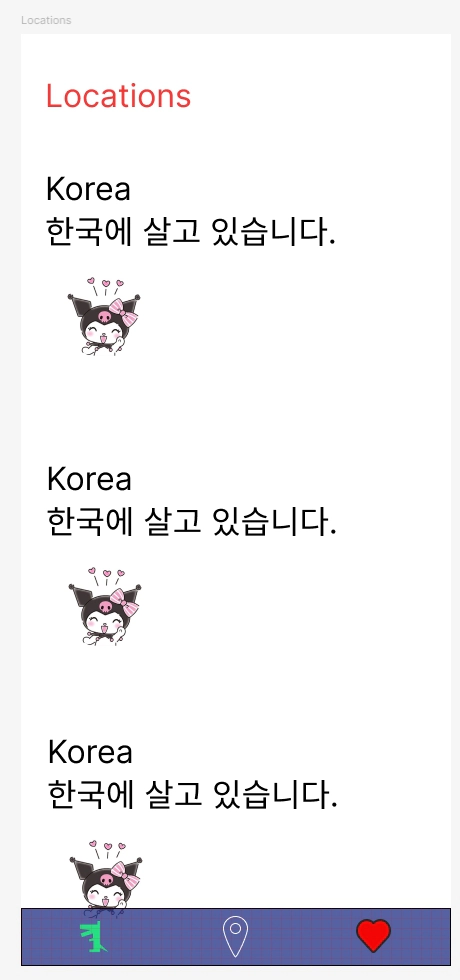 

사용자 카드를 만들어 전역으로 사용하는 예제다.

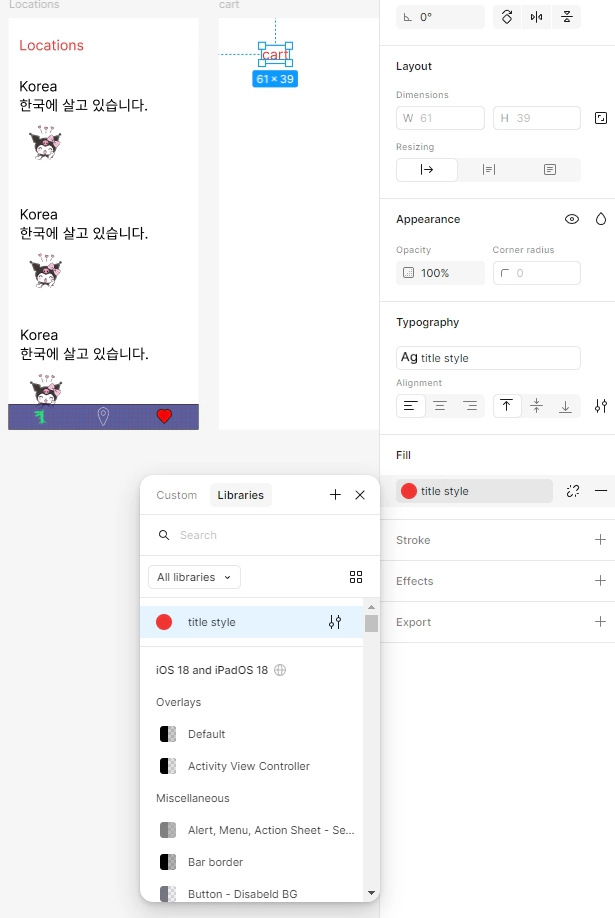 

스타일을 저장하고 팔레트로 사용할 수 있다.

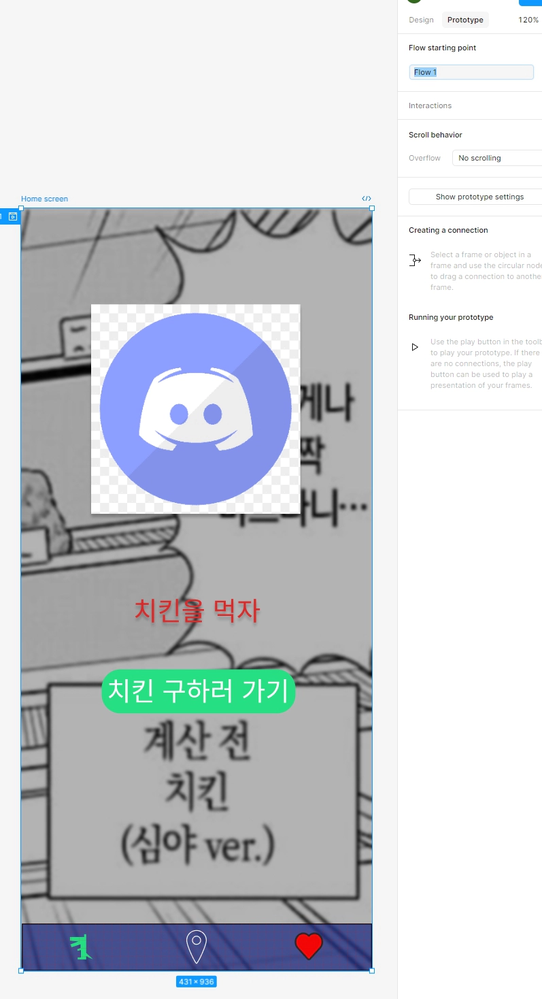
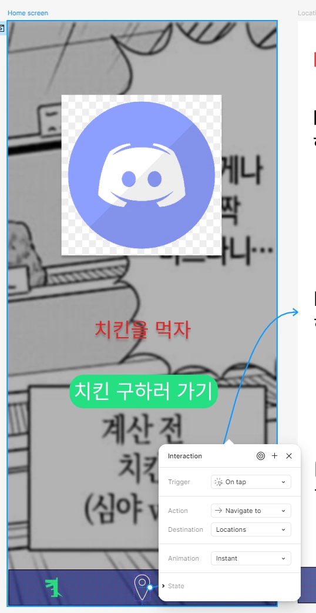
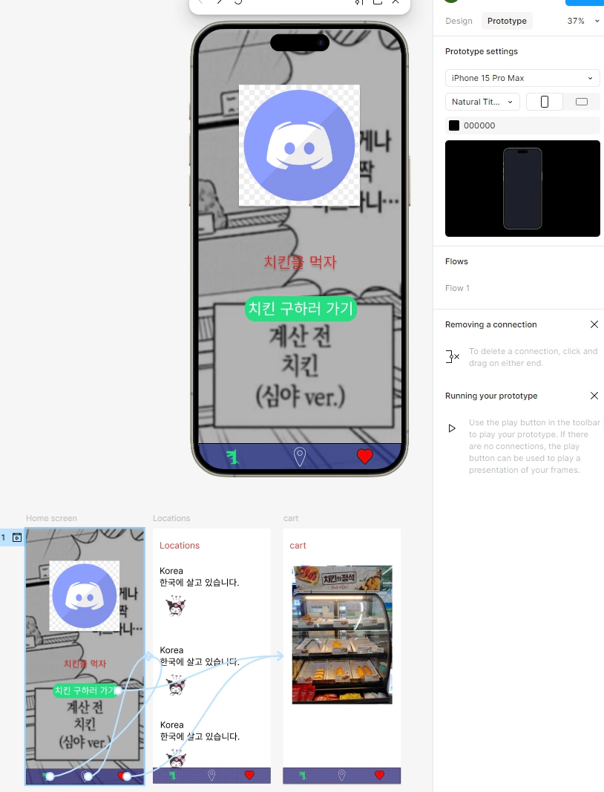 

만든 화면과 기능을 사용하기 위해 `prototype` -> `flow`를 생성하고 실행시킨다.

## 만들고 느낀 점

좋았던 점: 간단하고 직관적인 사용법으로 화면을 만들 수 있다.

배운 점: 피그마의 기본적인 사용법을 익혔다.

아쉬운 점: 피그마 디자인을 리엑트 코드로 만들기 위해 `Anima`를 배워야 한다.

향후 계획: `Anima` 사용법을 배우고 리엑트에서 구현할 것이다