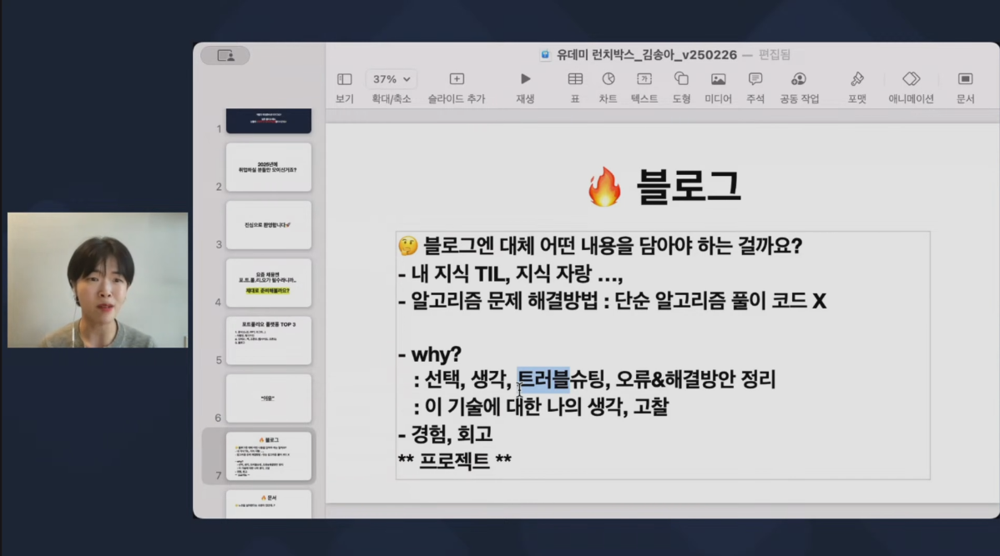
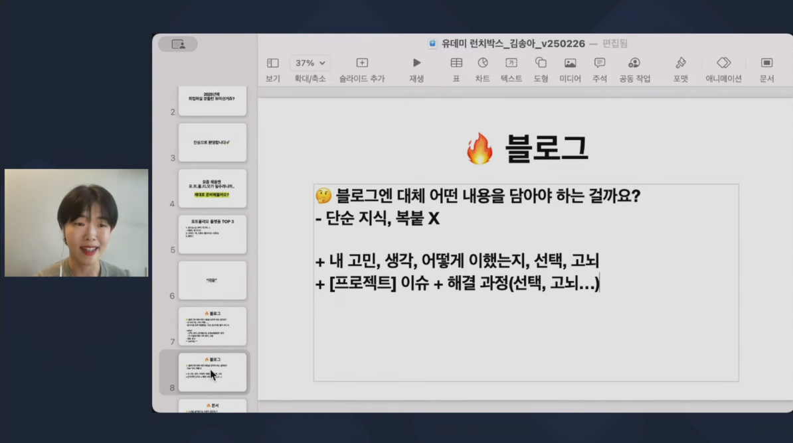
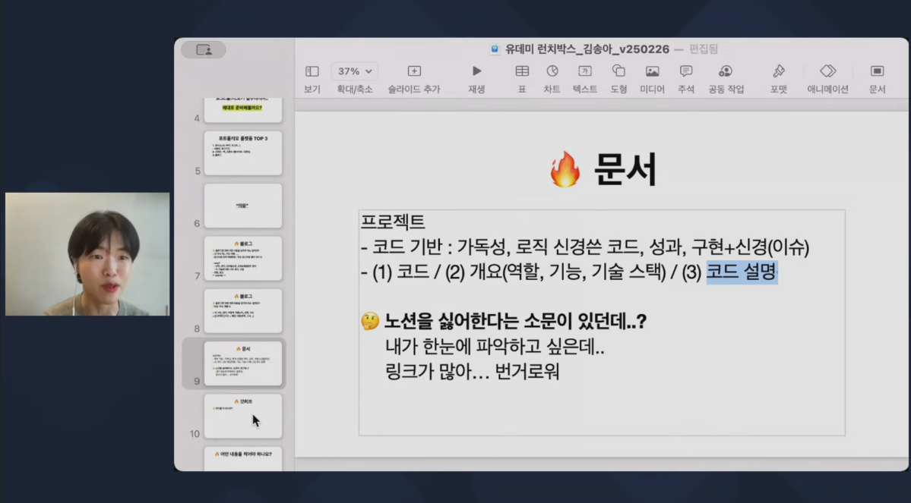

## 1.  소개 
>### 어서와, 개발자 포트폴리오는 처음이지?

요즘 개발자 채용 시장에서 포트폴리오는 선택이 아닌 필수라는 것, 다들 알고 계시죠? 😊

하지만 어떻게 구성해야 효과적인 포트폴리오가 될지 고민하는 분들이 많습니다.🤔

그래서 이번에 김송아 강사님을 모시고, 실무에서 인정받는 포트폴리오 준비 전략을 함께 배워보려고 합니다. :)

- 일시: 2025년 2월 26일 수요일 오후 12시!

----
## 2.  블로그를 작성하는 이유 
>### 1. 생각하는 개발자임을 어필하기 위해

- 단순 정보 처리는 기계를 사용하는 것이 효율적이지만 기계가 해결할 수 없는 문제가  발생하기도 한다. 그렇기 때문에 사람을 고용하는 것이다.  
- 그렇기 때문에 블로그에 정보를 정리하는 것만이 중요한게 아니라 정보 처리 방식과 그 과정에서 어떤 생각을 했고, 왜 그렇게 생각을 했는지 정리해야 한다.

---
>### 2. 어떤 내용이 들어가야 하는지

- 블로그는 하나의 포트폴리오이고, 그 목적에 맞게 프로젝트 문서에는 자신의 강점으로 어필하고 싶은 부분을 잘 풀어서 설명해야 한다. 
- **트러블**은 선택 또는 생각을 해야 했던 모든 이슈이다. 기술 스택 선정 등 자신이 결정할 수 있었던 부분을 적절한 이유를 들어 작성하는 것이 좋다.

---
### 3. README.md는 어떤 내용이 들어가야 하는지
자기소개서 또는 해당 프로젝트에서 어필하고 싶은 코드의 개요, 코드 설명 등이 들어가는 것이 좋다. 링크는 배제하는 것이 좋고 스크롤 형식으로 모든 내용을 확인할 수 있어야 한다.

----
## 3.  이 블로그가 바꿔야 할 것들 
>### 1.  프로젝트 문서
학원에서 진행했던 프로젝트에서 맡았던 역할과 제작한 기능에 대해 다시 한번 정리할 필요가 있다.
- 프로젝트의 개요와 기능, 나의 역할이 들어가야 하며 만들었던 기능 중에서 어필하고 싶은 코드를 선정해 리뷰해야 한다.
---
>### 2. learn 문서
어필하고 싶은 책을 문서화 시키는 것이기 때문에 책을 선정한 이유와 공부를 위한 계획이 문서의 개요에 들어가야 하며, 문서 내용의 가독성에 신경을 쓰며 작성시 회고 방식에서 **아쉬웠던 점**을 어려웠던 점으로 바꾸고 리뷰를 하면 작성이 원할하게 될 듯 하다.

---
>### 3 메인 페이지
링크 없는 자소서 형식으로 클릭을 배제하기 위해 스크롤 형식으로  진행했던 문서와 프로젝트의 이미지를 띄우고 기술스텍을 작성해야 한다. 

##  후기 

 펼치기 

1. **좋았던 점**: 목적을 상실하고 산으로 가는 블로그가 만들어지고 있었는데 좋은 강의를 들었다. 

2. **배운 점**: 다시 원점으로 돌아가 블로그를 작성하는 이유와 어필해야 하는 요소를 상기하게 되었다.

3. **아쉬운 점**: 뭔가 상황이 이상하게 돌아가는 것 같으면 잠시 멈춘 뒤, 문제를 파악하고 진행해야 하는데 현상만 골똘하게 생각하고 시간 박아서 해결하다 보니 강사가 하지 말라고 했던 것만 모아놓은 형태의 블로그가 됐다.

4. **향후 계획**: 이 블로그에서 바꿔야 하는 것을 3월 1주차 일정에 포함하고 고칠 것이다. 

 

