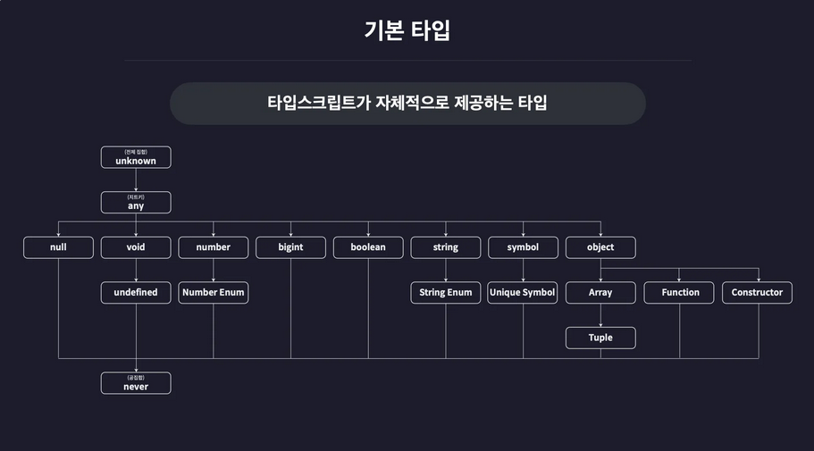

## 1. 컴파일러 설정
`tsconfig.json`이다. `tsx`를 사용하고 있기 때문에 별도의 설정이 필요하지 않아 간략하게 정리한다.

```json
{

  "compilerOptions": {

    "target": "ESNext",

    "module": "ESNext",

    "outDir": "dist",

    "strict": true,

    "moduleDetection": "force"

  },

  "include": ["src"]

}
```
### 1. 의미
- target : 컴파일 결과 생성되는 자바스크립트 코드의 버전 결정, ESNext는 최신 자바스크립트를 의미함

- module : 컴파일 결과 생성되는 자바스크립트 코드의 모듈 시스템 결정

- outDir : 컴파일 결과 생성되는 자바스크립트 파일들의 위치 결정

- strict : 엄격한 타입 검사 여부 설정

- moduleDetection : 모든 타입스크립트 파일(.ts)에 export 키워드를 자동으로 추가하여 격리된 모듈로 취급되도록 만드는 옵션

- include : tsc로 컴파일 할 타입스크립트 파일의 범위 설정

## 2. 기본 타입


타입 스크립트에서 자체적으로 제공하는 타입들을 계층에 따라 분류한 그림이다. 타입 스크립트는 변수 뒤에 콜론과 함께 타입을 정의하는 타입 어노테이션 방식을 사용해 선언한다.

### 1. 원시 타입

#### 1. number 타입
```ts
// number
let num1: number = 123;
let num2: number = -123;
let num3: number = 0.123;
let num4: number = -0.123;
let num5: number = Infinity;
let num6: number = -Infinity;
let num7: number = NaN;
```
정수, 소수, 음수, infinity, NaN등의 특수한 숫자도 포함할 수 있다.

#### 2. string 타입
```ts
// string
let str1: string = "hello";
let str2: string = 'hello';
let str3: string = `hello`;
let str4: string = `hello ${str1}`;
```
문자열을 의미하는 타입으로, 단순 쌍따옴표 문자열 뿐만 아니라 작은 따옴표, 백틱, 템플릿 리터럴로 만든 모든 문자열을 포함한다.

#### 3. boolean 타입
```ts
// boolean
let bool1 : boolean = true;
let bool2 : boolean = false;
```
참과 거짓만을 저장하는 타입이다. true 또는 false만 이 타입에 해당된다.

#### 4. null 타입
````ts
// null
let null1: null = null;
````
오직 null 값만 포함하는 타입이다.

##### 1. null 값을 다른 타입의 변수에 할당하기
타입스크립트에서 변수에 null 할당시 `NullCheck` 오류가 발생하는데 `tsconfig.json`의 `strcitNullChecks` 옵션을 바꿔주는 것으로 할당이 가능해진다.
안전한 코드 작성에 필요하지 않은 옵션이기 때문에 사용하지 않는다.

```json
{
  "compilerOptions": {
    "strictNullChecks": false
  },
  "ts-node": {
    "esm": true
  },
  "include": ["src"]
}
```

#### 5. undefined 타입
```ts
// undefined 타입
let unde1: undefined = undefined;
```
null 타입과 마찬가지로 오직 하나의 값 undefined만 포함하는 타입이다.

### 2. 리터럴 타입
변수에 하나의 값만 포함하게 만들 수 있다.
```ts
let numA: 10 = 10;
let strA: "hello" = "hello";
let boolA: true = true;
let boolB: false = false;
```


 