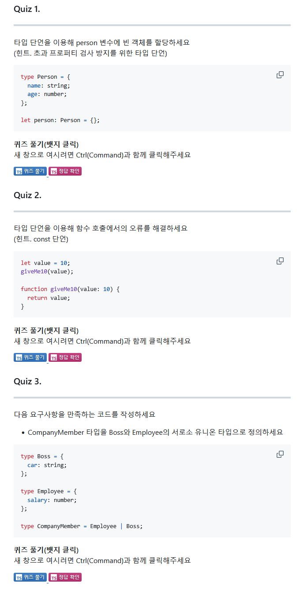
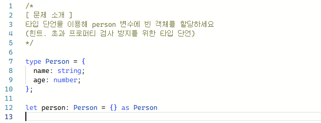
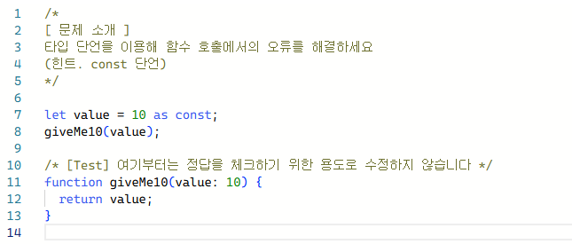
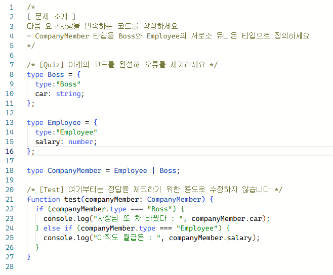

## 1. <span style={{ color: '#ffd33d' }}> 타입 단언 </span>

> ### 1. 타입 단언이란
```tsx
type Person = {
  name: string;
  age: number;
};

let person = {} as Person;
person.name = "";
person.age = 23;

type Dog = {
    name: string;
    color: string;
};

let dog: Dog = {
    name: "돌돌이",
    color: "brown",
    breed: "진도",
} as Dog
```
- 타입을 먼저 정의하고 초기화 시 빈 객체를 유지하고 싶을 때 `값 as 타입` 형태로 사용한다. 초과 프로퍼티 검사를 피할 때도 사용 가능하다. 
----
#### 1. 타입 단언의 조건
값이 타입의 슈퍼 타입이거나 서브 타입이어야 한다. 
```tsx
let num1 = 10 as never;   // ✅
let num2 = 10 as unknown; // ✅

let num3 = 10 as string;  // ❌
```
---
#### 2. 다중 단언
다중 단언 사용시 불가능한 타입 선언을 가능하게 만들 수 있다.
```tsx
let num3 = 10 as unknown as string;
```
- 다중 단언 사용시 순서대로 타입을 단언한다. 


- 10(number) -> unknown -> string

---
#### 3. cnost 단언
```tsx
let num4 = 10 as const;
// 10 Number Literal 타입으로 단언됨

let cat = {
  name: "야옹이",
  color: "yellow",
} as const;
// 모든 프로퍼티가 readonly를 갖도록 단언됨
```
- 변수를 const로 선언한 것과 비슷하게 타입이 변경된다.

---
#### 4. Non Null 단언
값 뒤에 `!` 를 붙여주면 이 값이 undefined이거나 null이 아닐것으로 단언한다.
```tsx
type Post = {
  title: string;
  author?: string;
};

let post: Post = {
  title: "게시글1",
};

const len: number = post.author!.length;
```

## 2. <span style={{ color: '#ffd33d' }}> 타입 좁히기 </span>

> ### 1. 타입 좁히기
타입 가드를 이용해 타입을 좁혀 사용할 수 있다.
```tsx
function func(value: number | string) {
  if (typeof value === "number") {
    console.log(value.toFixed());
  } else if (typeof value === "string") {
    console.log(value.toUpperCase());
  }
}
```
- 조건문을 사용하고 추가하는 방식으로 들어올 수 있는 타입을 좁힐 수 있다.

---
#### 1. instanceof 타입가드
내장 클래스 타입을 보장할 수 있는 타입가드를 만들 수 있다.
```tsx
function func(value: number | string | Date | null) {
  if (typeof value === "number") {
    console.log(value.toFixed());
  } else if (typeof value === "string") {
    console.log(value.toUpperCase());
  } else if (value instanceof Date) {
    console.log(value.getTime());
  }
}
```
- instanceof는 클래스에만 사용가능하기 때문에 타입과 함께 사용할 수 없으니 주의해야 한다.

---
#### 2. in 타입 가드
```tsx
type Person = {
  name: string;
  age: number;
};

function func(value: number | string | Date | null | Person) {
  if (typeof value === "number") {
    console.log(value.toFixed());
  } else if (typeof value === "string") {
    console.log(value.toUpperCase());
  } else if (value instanceof Date) {
    console.log(value.getTime());
  } else if (value && "age" in value) {
    console.log(`${value.name}은 ${value.age}살 입니다`)
  }
}
```
- 직접 만든 타입과 함께 사용할 수 있다.

---
## 3. <span style={{ color: '#ffd33d' }}> 서로소 유니온 타입 </span>
>### 1. 서로소 유니온 타입

교집합 관계에 있는 타입들을 모아 만든 유니온 타입의 집합이다.
```tsx
type Admin = {
  tag: "ADMIN";
  name: string;
  kickCount: number;
};

type Member = {
  tag: "MEMBER";
  name: string;
  point: number;
};

type Guest = {
  tag: "GUEST";
  name: string;
  visitCount: number;
};

type User = Admin | Member | Guest;


function login(user: User) {

    if ("kickCount" in user) {

        // Admin

        console.log(`${user.name}님 현재까지 ${user.kickCount}명 추방했습니다`);

    } else if ("point" in user) {

        // Member

        console.log(`${user.name}님 현재까지 ${user.point}모았습니다`);

    } else {

        // Guest

        console.log(`${user.name}님 현재까지 ${user.visitCount}번 오셨습니다`);

    }

}
```
- 유저의 3 분류의 역할을 `tag` 속성을 추가해 관리할 수 있다. 

```tsx
function login(user: User) {

  if (user.tag === "ADMIN") {

    console.log(`${user.name}님 현재까지 ${user.kickCount}명 추방했습니다`);

  } else if (user.tag === "MEMBER") {

    console.log(`${user.name}님 현재까지 ${user.point}모았습니다`);

  } else {

    console.log(`${user.name}님 현재까지 ${user.visitCount}번 오셨습니다`);

  }

}
```
```tsx
function login(user: User) {
  switch (user.tag) {
    case "ADMIN": {
      console.log(`${user.name}님 현재까지 ${user.kickCount}명 추방했습니다`);
      break;
    }
    case "MEMBER": {
      console.log(`${user.name}님 현재까지 ${user.point}모았습니다`);
      break;
    }
    case "GUEST": {
      console.log(`${user.name}님 현재까지 ${user.visitCount}번 오셨습니다`);
      break;
    }
  }
}
```

- 타입 가드 또는 switch 구문을 사용해 코드의 직관성을 높일 수 있다.

## 4. <span style={{ color: '#ffd33d' }}> 과제 </span>






**출처** : [한 입 크기로 잘라먹는 타입스크립트 - 이정환](https://www.inflearn.com/course/%ED%95%9C%EC%9E%85-%ED%81%AC%EA%B8%B0-%ED%83%80%EC%9E%85%EC%8A%A4%ED%81%AC%EB%A6%BD%ED%8A%B8/dashboard)
