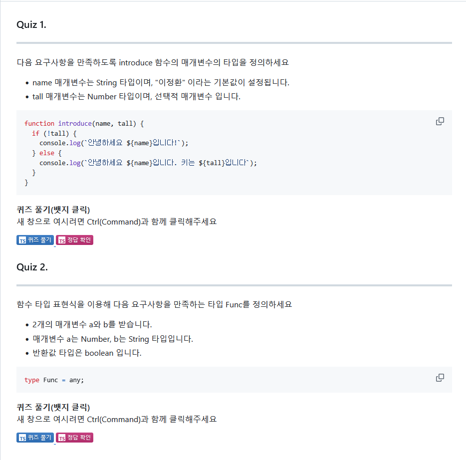
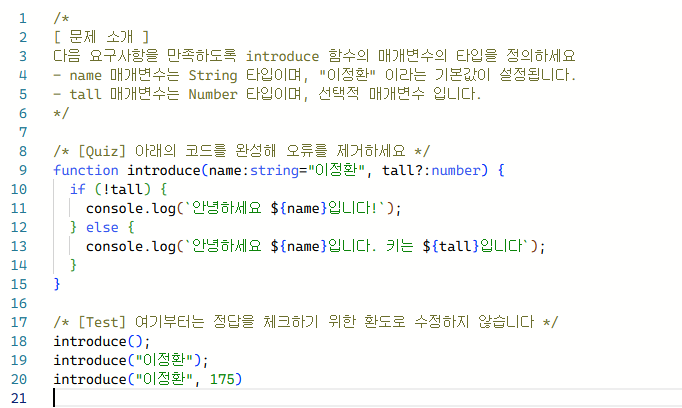
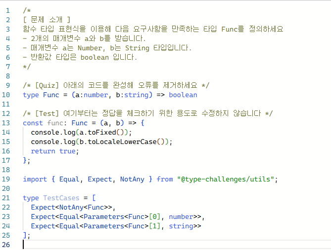

## 1. <span style={{ color: '#ffd33d' }}> 함수 타입 </span>
>### 1. 함수의 타입을 정의하는 방법

```tsx
function func(a: number, b: number): number {
  return a + b;
}
```
- 함수의 타입은 매개변수와 반환값의 타입으로 결정하고 반환값은 자동으로 추론되기 때문에 생략 가능하다.

---

#### 1. 화살표 함수 타입 정의하기
```tsx
const add = (a: number, b: number): number => a + b;
```
---
#### 2.  매개변수 기본값 설정하기

```tsx
function introduce(name = "이정환") {
	console.log(`name : ${name}`);
}
```
- 매개변수에 기본값이 설정되어있으면 타입을 자동으로 추론한다.

---
#### 3. 선택적 매개변수 설정하기
매개변수의 뒤에 `?` 를 붙여 생략가능하게 만든다. 
```tsx
function introduce(name = "이정환", tall?: number) {
  console.log(`name : ${name}`);
  if (typeof tall === "number") {
    console.log(`tall : ${tall + 10}`);
  }
}
```
- 선택적 매개변수의 타입은 자동으로 undifined 가 된다. 타입을 좁히기 위한 조건문을 추가할 수 있다.

----
#### 4. 나머지 매개변수

```tsx
function getSum(...rest: [number, number, number]) {
  let sum = 0;
  rest.forEach((it) => (sum += it));
  return sum;
}

getSum(1, 2, 3)    // ✅
getSum(1, 2, 3, 4) // ❌
```
- rest 형식으로 타입을 정의하고 튜플을 사용해 배열 길이를 고정할 수 있다.
---
## 2. <span style={{ color: '#ffd33d' }}> 함수 타입 표현식과 호출 시그니쳐 </span>
>### 1. 함수 타입 표현식
```tsx
type Add = (a: number, b: number) => number;

const add1: Add = (a, b) => a + b;

const add2: (a: number, b: number) => number = (a, b) => a + b;

type Operation = (a: number, b: number) => number;

const add3: Operation = (a, b) => a + b;
const sub: Operation = (a, b) => a - b;
const multiply: Operation = (a, b) => a * b;
const divide: Operation = (a, b) => a / b;
```
- 여러 함수가 동일한 값을 사용핼 때 사용된다.


- 함수 타입 표현식을 사용해 간결하게 만들 수 있다.

---
>### 2. 호출 시그니쳐
```tsx
type Operation2 = {
    (a: number, b: number): number;
    name: string;
};

const add2: Operation2 = (a, b) => a + b;

add2(1, 2);
add2.name;
```
- 매개변수와 반환타입을 지정하고 추가 프로퍼티를 생성할 수 있다.

---
## 3. <span style={{ color: '#ffd33d' }}> 함수 타입의 호환성 </span>
특정 함수 타입이 다른 함수 타입으로 대체될 수 있는지 두 가지 기준으로 판단하는 것을 의미한다.

---
>### 1. 반환값 타입이 호환되는가?
A와 B 함수 타입이 있다고 가정할 때 A 반환값 타입이 B 반환값 타입의 슈퍼타입이라면 두 타입은 호환된다.
```tsx
type A = () => number;
type B = () => 10;

let a: A = () => 10;
let b: B = () => 10;

a = b; // ✅
b = a; // ❌
```
- b=a 로 하는 것은 호환성 문제가 발생한다.

---
>### 2. 매개변수의 타입이 호환되는가?
#### 1.  매개변수의 개수가 같을 때
C와 D가 있다고 가정할 때 두 타입의 매개변수의 개수가 같다면 C 매개변수의 타입이 D 매개변수 타입의 서브 타입일 때에 호환된다.
```tsx
type C = (value: number) => void;
type D = (value: 10) => void;

let c: C = (value) => {};
let d: D = (value) => {};

c = d; // ❌
d = c; // ✅
```
----
#### 2.  매개변수의 개수가 다를 때
```tsx
type Func1 = (a: number, b: number) => void;
type Func2 = (a: number) => void;

let func1: Func1 = (a, b) => {};
let func2: Func2 = (a) => {};

func1 = func2; // ✅
func2 = func1; // ❌
```
----
## 4. <span style={{ color: '#ffd33d' }}> 과제 </span>


