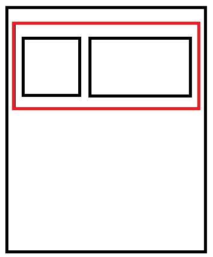
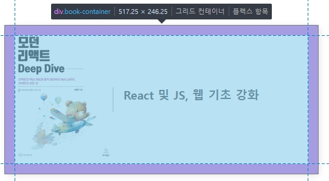
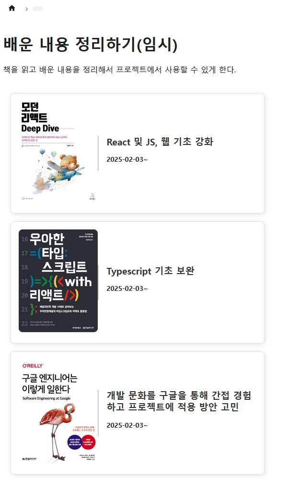
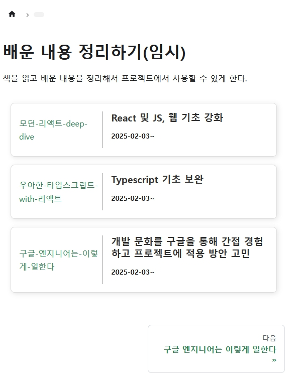

## 진행 이유

기존의 블로그는 마크다운 형식으로 페이지를 출력하고 있기 때문에 리액트의 기능을 활용하지 않고 문서 형태로의 블로그 관리를 하고 있었다.
블로그에 변화를 주고 라우팅 기능을 효과적으로 추가하기 위해 기능을 추가하기로 했다.

### 도큐사우르스 페이지에서 컴포넌트를 호출하려면

도큐사우루스는 문서관리를 최적화 시켜주는 목적으로 만들어졌기 때문에 `.md` 또는 `.mdx`파일 형식으로 제작 하여 페이지에 출력할 수 있다.
평소 문서를 작성하듯 `HTML`을 출력할 수 있는`.md`를 사용하려고 했지만 해당 방식으로는 기능 전환과 유지보수가 힘들 것이라고 판단하고 컴포넌트를 사용하기로 했다.

### 구상

#### 화면


배열 형식의 데이터를 받고 해당 화면으로 이미지와 제목, 설명, 진행기간을 반복적으로 호출한다고 가정하고 진행한다.

#### 데이터
```typescript
interface Book {
    id: number;
    name: string;
    image: string;
    description: string;
    date: string;
}
```
책의 데이터 타입을 정의하고 속성값을 가져오도록 만든다.

```typescript
import React, { useEffect, useState } from "react";

const page = () => {
    const [books, setBooks] = useState<Book[]>([]);

    useEffect(() => {
        // 추후 데이터베이스를 사용해 불러올 것이기 때문에 webp 이미지를 사용할 것이다.
        const fetchData = async () => {
            const data = [
                // { id: 0, name: "asdasd", date: "", description: "asd", image: "  " }
                { id: 1, date:"2025-02-03~", name:"모던-리액트-deep-dive", description: "React 및 JS, 웹 기초 강화", image: "https://cdn.discordapp.com/attachments/1338544385217921084/1338544419497967616/mrdd.jpg?ex=67ab7822&is=67aa26a2&hm=b7ec3fb9ef4a1691e4b1c014bfc1bd5fb946c97d678a7d81504345181a6deb4a&" },
                { id: 2, date:"2025-02-03~", name:"우아한-타입스크립트-with-리액트", description: "Typescript 기초 보완", image: "https://cdn.discordapp.com/attachments/1338544385217921084/1338544697987170344/wtr.jpg?ex=67ab7864&is=67aa26e4&hm=029792322e5c8a589e3e0e0d109e2fc5d8848c8c04b2d0577fcc7f4713c7ef94&" },
                { id: 3, date:"2025-02-03~", name:"구글-엔지니어는-이렇게-일한다", description: "개발 문화를 구글을 통해 간접 경험하고 프로젝트에 적용 방안 고민", image: "https://cdn.discordapp.com/attachments/1338544385217921084/1338544698301878394/gew.jpg?ex=67ab7865&is=67aa26e5&hm=b8b7a5b5bc9954bd45091322b22efa2168674dd962039e1e6789ef5c30322d97&" },
            ];
            setBooks(data);
        };
        fetchData();
    }, []);
};

export default page;
```

이런 식의 데이터가 넘어오게 데이터베이스를 구상하고 만들 것이다.

```javascript
return (
    <div className="book-list">
    {books.map((books) => (
            <div key={books.id} className="book-container">
        <div className="book-image" >
    
</div>
<div className="book-info">
    <h2>{books.description}</h2>
    <h5>{books.date}</h5>
    </div>
    </div>
))}
</div>
);
```
화면을 반복적으로 출력한다.



이미지를 클릭하면 화면이 이동하게 만들어야 한다.

```javascript
<Link to={`./category/${books.name}`}>
 
</Link>
```
도큐사우루스에서 지원하는 `Link` 기능을 이용해서 데이터를 받고 감싸주었다.



정상적으로 화면을 출력할 수 있게 된다.



디스코드를 이용해 `webp`주소를 만들어 이미지를 사용했기 때문에 인터넷 연결이 끊기면 이런 식으로 화면이 출력된다는 단점이 있다.

## 만들고 느낀 점

좋았던 점: 도큐사우루스에서 리액트를 사용해 기능을 추가하고 유지보수 기능을 강화했다.

배운 점: 디스코드 앱을 사용하는 방법을 몰랐는데 이런 방식으로도 사용할 수 있다는 것을 알게 되었다. 아마 동영상 파일도 비슷하게 작용할 것 같으니 기회가 있다면 니트로 서비스를 구독할 계획이다.

아쉬웠던 점: 오랜만에 리액트를 사용해서 화면을 만들다 보니 이런 기초적인 화면을 만드는 과정에서 시간을 잡아먹었다. 연습이 부족하다는 것을 느꼈다.

향후 계획: 컴포넌트를 사용할 수 있다는 것을 알게 되었으니 다양한 방식을 도큐사우루스에 적용해 볼 계획이다.

