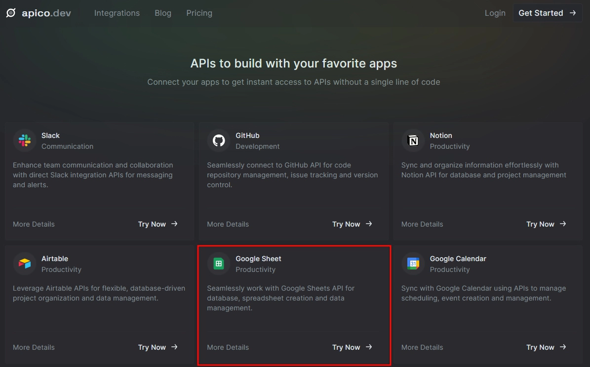
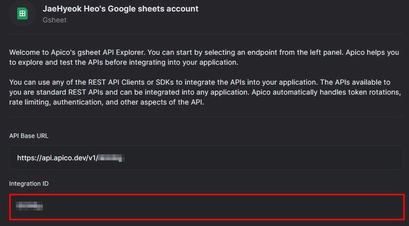
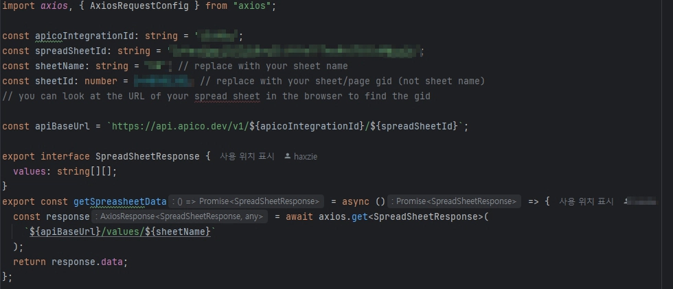
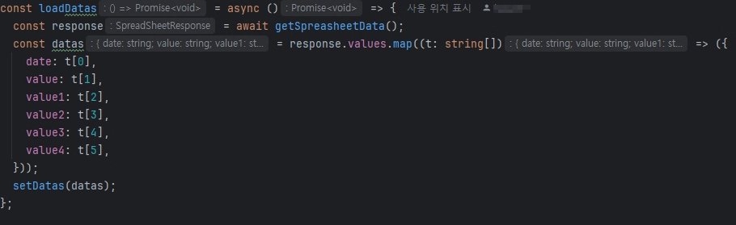
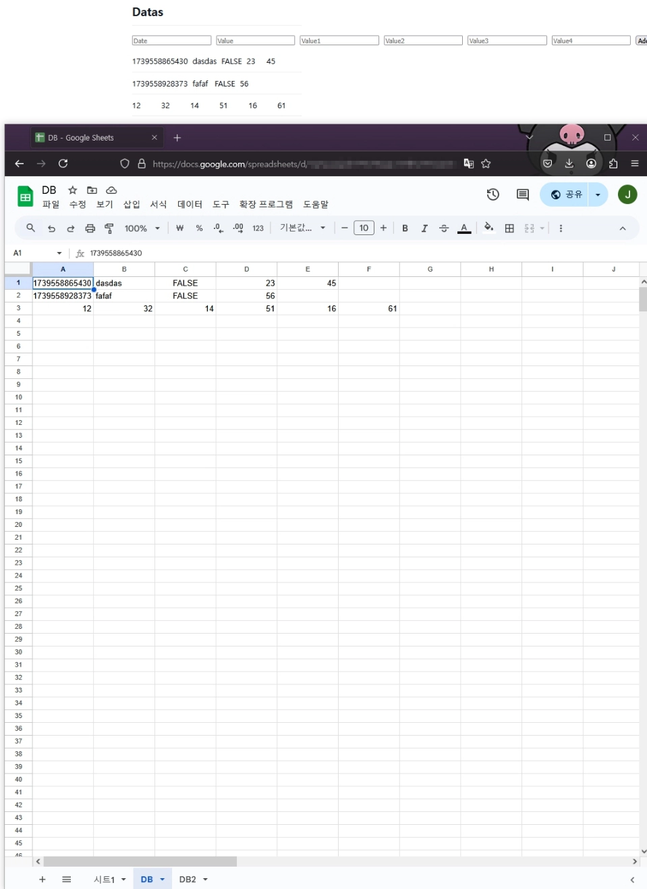

## 진행 이유
미니 프로젝트 DB를 스프레드 시트를 사용해보기로 했다.
### 방법
`Apico`를 사용해 스프레드 시트 `API`를 가져왔다.   
  
스프레드 시트를 선택해준다.  

  
인증 키 같은 것이다. 구글 인증 키 보다 발급이 편하고 빠르게 사용할 수 있다.  
  
스프레드 시트를 링크 공개 상태로 만들고 `URL`을 가져온다.  
  
sheets.ts에 데이터를 입력한다.  
  
값은 구글시트와 마찬가지로 행에 맞는 데이터 값을 가져온다.  
  
입력 필드에 설정한 값이 제대로 들어간 것을 확인할 수 있다.  

## 작성하고 느낀 점
좋았던 점: 스프레드 시트를 사용해보았다. 매우 손쉽게 데이터베이스를 구성할 수 있었다.

배운 점: 구글 키 외에도 다른 서비스가 있다는 것을 알게 되었다.

아쉬운 점: 하나의 시트만 들고올 수 있는 것 같다. 진짜 데이터베이스 처럼 사용하려면 매우 많은 열이 요구된다. 데이터베이스 가독성은 많이 떨어지게 되었다.

향후 계획: 쓰는 방법 알았으니 활용 해야 한다. 화면 구상이 끝나면 데이터 모델 만들어서 적용 시킬 일이 남아있다. 
