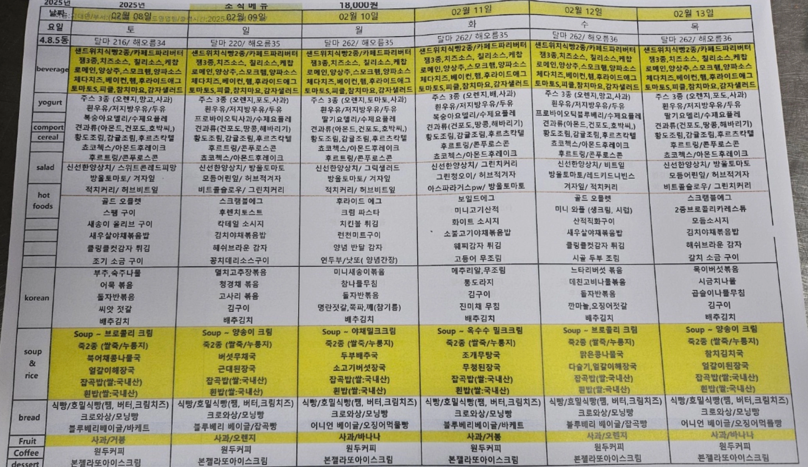
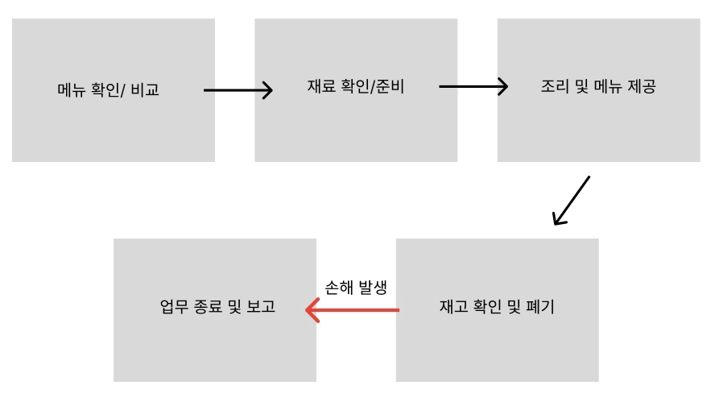
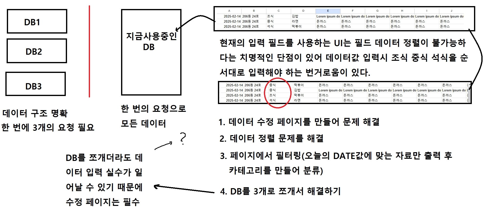
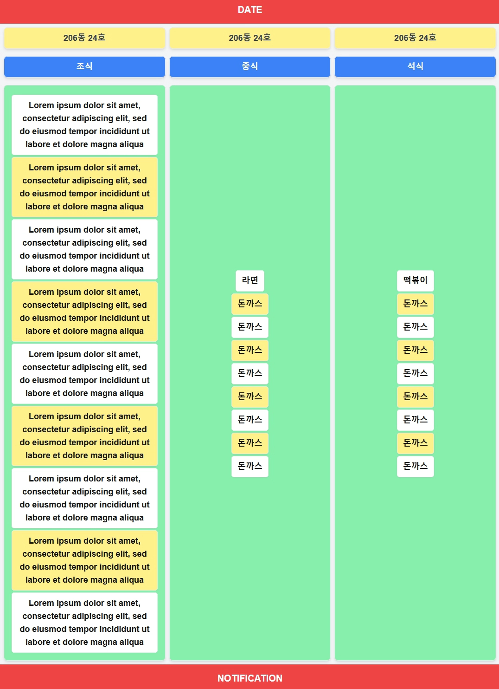
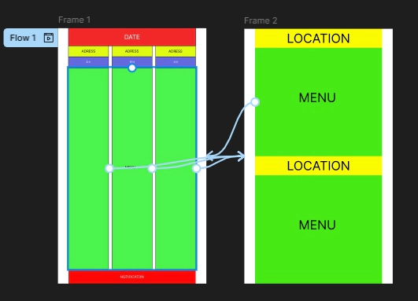

## 진행 이유

### 1. 환경 분석

현재 업장은 복잡하고 가독성이 낮은 메뉴판을 사용하고 있어 재고 파악이 어려우며, 이로 인해 남은 재료가 폐기되는 상황이 자주 발생하고 있다. 
또한, 업장 특성상 직원 교체가 빈번하게 이루어져 운영 매뉴얼이 현상 유지 수준에 머물러 있으며, 불필요한 정보와 태그가 포함되는 경우도 많아 효율적인 업무 수행이 어렵다. 
특히, 사용한 재료와 겹치는 메뉴를 파악하기 위해 별도의 메뉴판을 확인해야 하는 번거로움이 존재한다.

### 2. 7s 분석
- Content (내용) → 메뉴판이 복잡하고 불필요한 정보 포함  
- Context (맥락) → 시간별 메뉴와 겹치는 재료 확인이 어려움  
- Community (커뮤니티) → 직원 간 메뉴 및 재고 공유가 어려움  
- Customization (맞춤화) → 메뉴판이 시간대에 맞춰 최적화되지 않음  
- Communication (소통) → 메뉴 및 재고 현황을 직관적으로 전달할 수 없음  
- Commerce (상거래) → 비효율적인 운영으로 인해 원가 절감 기회 상실  
- Connection (연결성) → 재료가 겹치는 메뉴 확인을 위해 별도 메뉴판이 필요하여 불편  

### 3. 트렌드 분석
최근 외식업계에서는 디지털화, 자동화, 그리고 운영 효율성을 중시하는 흐름이 두드러지고 있다.
- 디지털화 → 종이 메뉴판 대신 디지털 메뉴판 및 재고 관리 시스템 활용 증가
- 자동화 → 재료 파악 후 동일 재료를 강조하는 기능이 필요
- 효율성 중시 → 메뉴 정보를 한눈에 볼 수 있는 UI/UX 중요

### 4. 결론 

- 효율적인 메뉴판 관리 및 최적화
- 동일 재료 파악 시스템 도입
- 불필요한 정보 및 태그 정리

## 2. 어떻게 고쳐야 하는가

프로세스를 간단히 도식화 하면 이런 모양이 나오게 된다. 재고 확인 및 폐기 과정에서 손해가 발생하고 있기 때문에 원인을 고쳐야 한다.
이를 해결하기 위해 위에서 정리한 방법으로 큰 스크린에 데이터를 띄워야 하는데 앱을 만들어 배포하기로 했다.

### 1. 데이터
앱을 먼저 만들기 전에 데이터를 구상해야한다. 빠른 설정을 위해 구글 스프레드 시트를 데이터베이스로 하고 진행했다.
필요한 데이터는 `날짜, 주소, 시간(조식,중식,석식), 1~9 까지의 필드`다. 이 중 1~4는 반드시 양식 또는 스페셜 메뉴로 분류하며 5~9는 한식과 음료 디저트 과일 셀러드의 필드로 사용된다.  
입력될 데이터는 `ID[0], 날짜[1], 주소[2], 시간[3], 메뉴[4~12]`

데이터를 구상 중 문제가 발생했다. 시트에서 데이터 정렬시 뒤죽박죽 되는 현상이 발생했다. 이것을 해결하기 위해 DB를 쪼개거나 필터를 추가해야 했는데 요청 3개를 받아오는 것 보다 1개를 받아오는 게 더 효율적이었기 때문에 후자를 택했다.

### 2. 화면
직관적인 UI가 필요했고 한 번에 오늘 사용될 모든 메뉴를 출력해야 한다. 

당장 데이터를 받아왔을 때 이와 같은 형태가 된다. 

여기서 메뉴를 클릭하거나 어떤 조건에 도달하면 현 시간에 맞는 메인 메뉴를 크게 띄우고 `1~4 필드`와 `5~9 필드`를 구별해 배치해야 한다.
데이터를 받고 해당하는 메인 메뉴들의 사진과 재료를 출력하면 된다.

## 작성하고 느낀 점
좋았던 점: 요청을 받고 화면을 구상하는 과정이 즐거웠다. 

배운 점: 백엔드를 사용하지 않고 CRUD를 사용해 보았다. 

아쉬운 점: 막히는 곳이 너무 많았다. 시트를 데이터베이스로 처음 썼기 때문에 데이터 구조에서 먼저 막히고 입력값이 의미가 없다는 것을 깨닫는데 까지 시간을 많이 사용했다. 프로젝트에 시트 API 연동시 추가적인 에러가 발생했기 때문에 이것도 스스로 처리해야 했다.
생각한 화면을 당장 코드로 짜는게 힘들었기 때문에 피그마 툴을 익히는데 시간을 사용했다. 무계획적으로 시간을 사용하다 보니 정작 해야할 일들을 제대로 하지 못하고 프로젝트도 이상한 형태로 만들어지고 있었다.

향후 계획: 반드시 계획을 짜고 진행해야 한다. 에러는 반드시 생긴다고 가정하고 프로젝트를 진행해야 하고, 기한 내에 완수하기 위해 체계적인 계획을 만들어 진행해야 한다. 협업이 중요한 이유이기도 하다.

