## 1.  업무 워크플로우 분석
### 1. 전체적인 프로세스
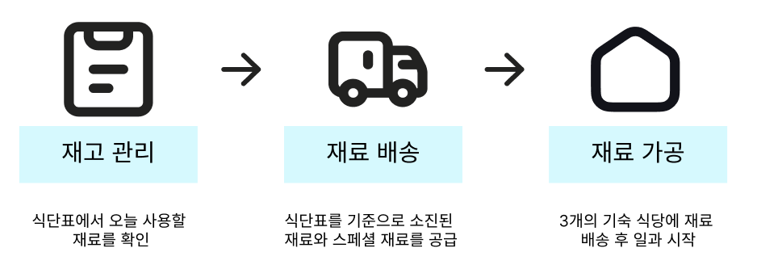
식단표를 기준으로 모든 프로세스가 진행되는 것을 확인할 수 있다. 
### 2. 각 팀별 프로세스
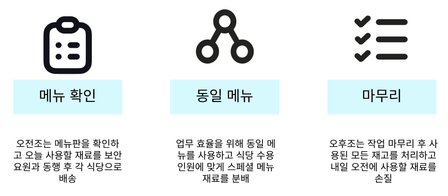
업장 특성상 인원을 메꾸는 상황이 자주 발생한다고 한다. 그렇기 때문에 오전조는 오후조의 식단표 역시 가지고 다녀야 하며 오후조는 돌발상황에 대비하기 위해 다음날 오전에 사용할 재료를 반드시 손질해야 한다.
### 3. 기본 원칙
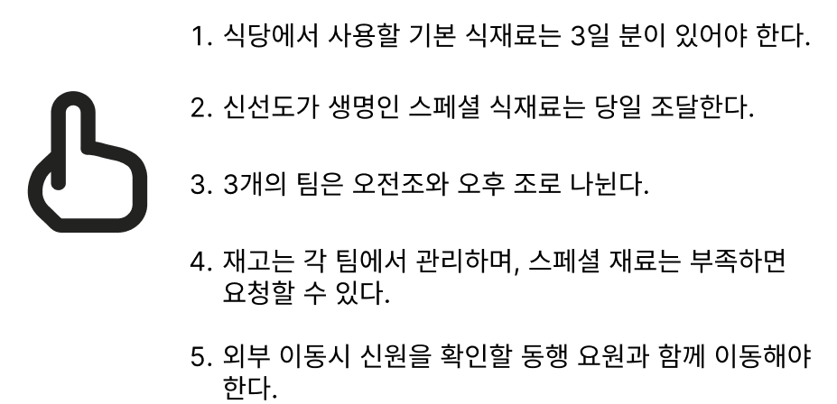
업장의 기본 원칙이다. 실무자가 배송까지 담당하고 있기 때문에 `5번 메뉴얼`의 제약으로 재고 소진으로 인한 이동시 업무 효율이 급격하게 떨어지게 된다.
### 4. 업무 현황
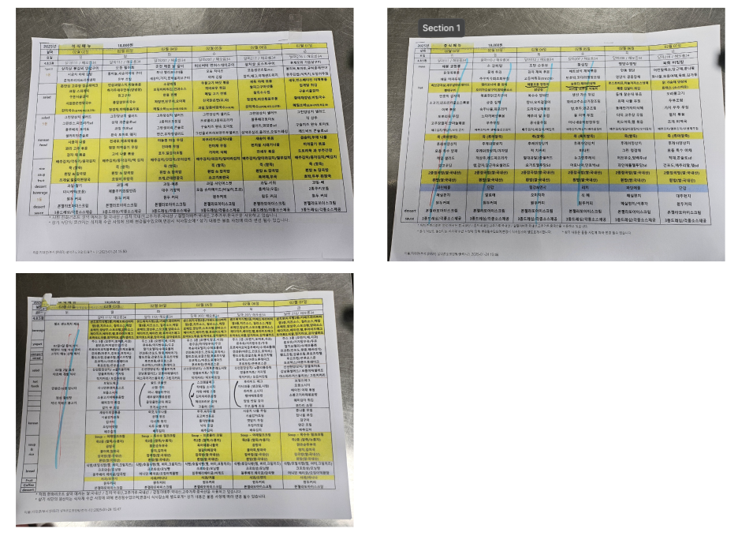
각 팀의 업장에 3개의 식단표를 붙여 운영하고 있다. 식단표와 조리기구 사이의 거리가 멀 경우 개인이 소지하고 다녀야 하는 상황이다. 해당 식단표를 기준으로 모든 업무가 진행된다.
## 2. AS-IS
### 1. 문제점
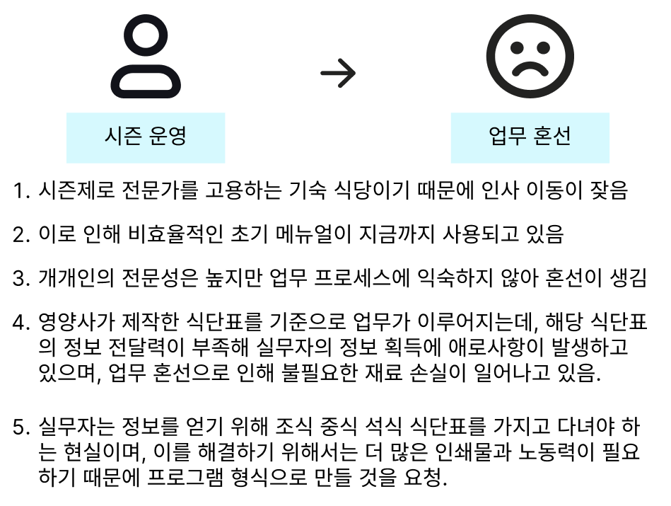
### 2. 문제가 일어나는 파트
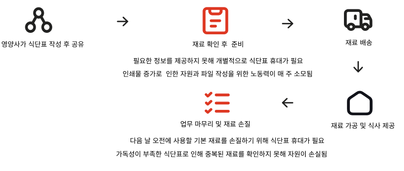
지금까지의 내용을 도식화 했을 때 이런 그림이 나오며, 문제가 일어나고있는 2개의 부분을 해결해야 한다.
### 3. 문제를 해결하기 위한 클라이언트 요구사항
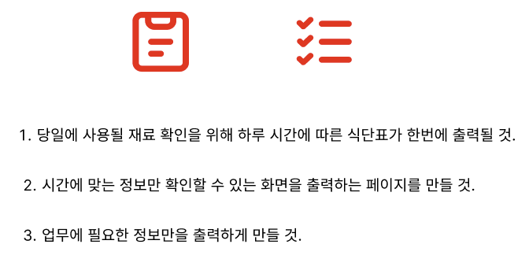
### 4. 솔루션
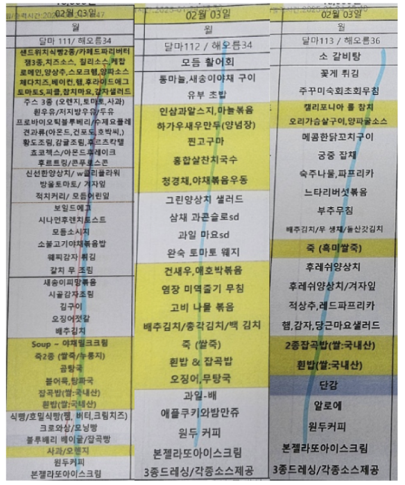
현제 사용자들이 사용하고 있는 방식이라고 한다. 식단표를 잘라내고 개인이 보기 좋은 곳에 붙여두어 사용하는 것으로 보인다.
### 3. TO-BE
### 1. 아키텍처 설계
시스템을 구성할 기능들과 데이터 모델링을 정의했다.
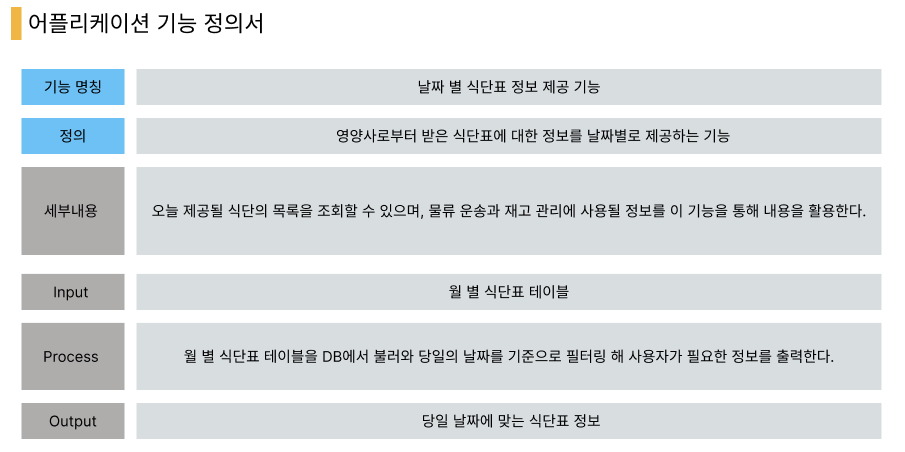
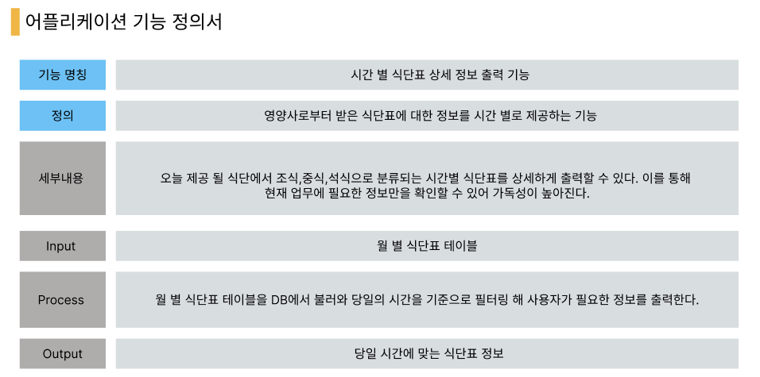
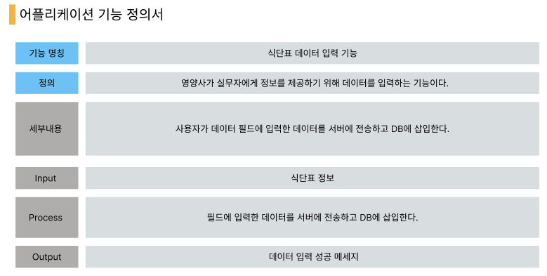
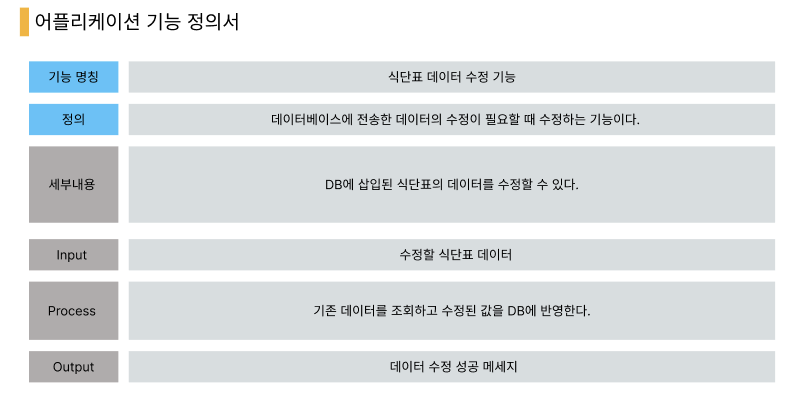
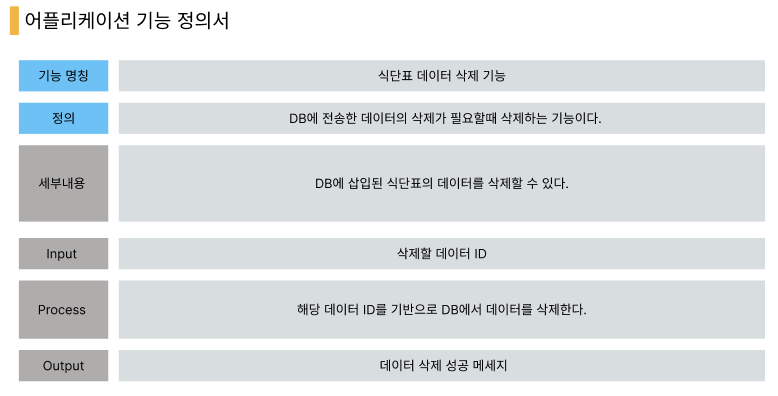
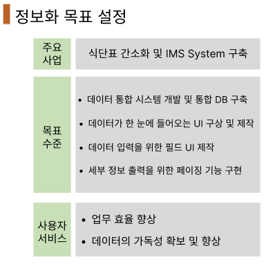
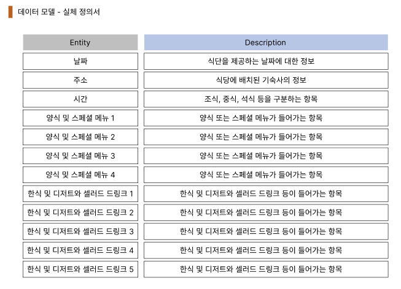
### 2. 기대 효과
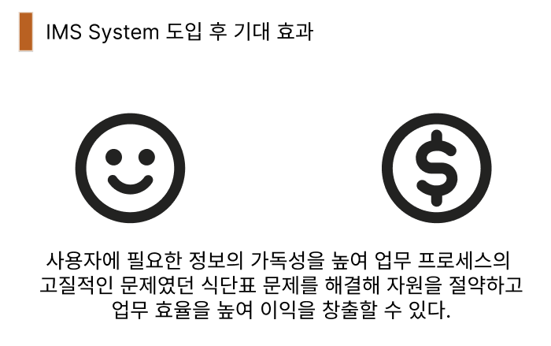